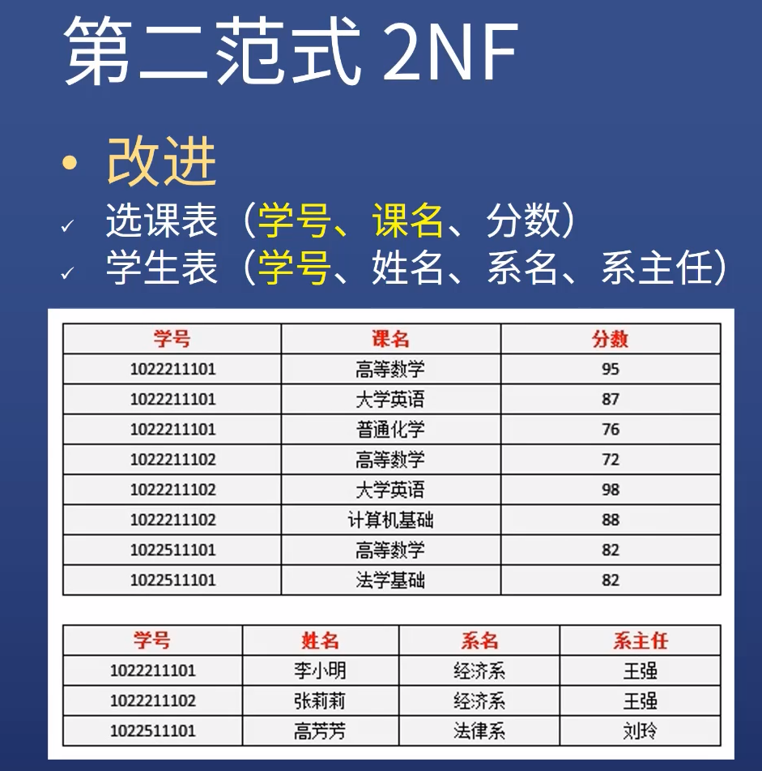

# 关系型数据库的范式
范式：可理解为设计标准


## 第一范式 1NF 

1NF 即 字段不可再分

例如 视力 分为左右眼，  那么存在数据库里应该为 left_eye right_eye 两个字段。而不是一个字段

第一范式不够强


## 第二范式 2NF

定义
- 在1NF 基础张， 要有键（键可多个字段组合）
- 所有字段分别完全依赖于键
- 如果键是多个字段组合，则**不允许部分依赖**于该键

依赖关系
- 给出键，就能唯一确定字段的值
- 如给出学号，就能唯一确定姓名，反之则不行
- 则称姓名依赖于学号 

不满足第二范式的地方
- 上表的键位（学号，课名）组合键
- 但存在部分依赖，姓名依赖于学号


改进
选课表 学号 课名为主键
学生表  学号为主键



## 第三范式 3NF

- 一个表不能有两层依赖
- 给出学号，就能确定系名： 系名依赖于学号
- 给出系名， 就能确定系主任： 系主任依赖于系名
- 所以，系主任间接依赖于学号

解决办法 把系名和系主任单独建表

## 总结

- 第一范式 -> 属性不可分割
- 第二范式 -> 字段完全依赖于键 
- 第三范式 -> 字段没有间接依赖于键
- BC范式 -> 键中的属性也不存在间接依赖


# 数据库设计经验

高内聚
- 把相关的字段放到一起，不相关的分开建表
- 如果两个字段能够单独建表，那就单独建表

低耦合
- 如果两个表之间有弱关系
- -一对一可放在一个表，也可两个表加外键
- 一对多一般用外键
- 多对多一般用中间表


# JOIN


users 表  orders 表

`select users.name, orders.amount from users inner join orders on users.id = orders.user_id`

inner join  结果包含 users.id = orders.user_id

left join  结果包含 users 的所有数据， 即使 orders 表里没有user_id 对应 users.id。 在也结果中 （保留右边的null，以保证左边都显示）

right join   类似 （保留左边的null，以保证右边都显示）

full outer join  很少用的上 先不研究

# 缓存字段 、事务、 存储引擎InnoDB 

## 缓存字段
获取blog 的评论comments 数量

- select count(id) from comments where blog_id=8
- 但是太慢了
- 可以在blog 表加一个comment_count 字段， 添加comment 时+1 删除comment时-1 
 
## 事务

有些操作必须一次完成

1. 在comments表新增记录 
2. 在blog表将对应的comment_count +1 

如果1 执行了  2 没执行 ， 数据就乱了。

这时候应该使用事务， 只要出错 则全部都不生效 

```
start transaction;
sql1; sql2; sql3;
commit;
```

## MySQL存储引擎
通过 `show engines`查看


默认是 InnoDB

```
mysql> show engines
    -> ;
+--------------------+---------+----------------------------------------------------------------+--------------+------+------------+
| Engine             | Support | Comment                                                        | Transactions | XA   | Savepoints |
+--------------------+---------+----------------------------------------------------------------+--------------+------+------------+
| InnoDB             | DEFAULT | Supports transactions, row-level locking, and foreign keys     | YES          | YES  | YES        |
| MRG_MYISAM         | YES     | Collection of identical MyISAM tables                          | NO           | NO   | NO         |
| MEMORY             | YES     | Hash based, stored in memory, useful for temporary tables      | NO           | NO   | NO         |
| BLACKHOLE          | YES     | /dev/null storage engine (anything you write to it disappears) | NO           | NO   | NO         |
| MyISAM             | YES     | MyISAM storage engine                                          | NO           | NO   | NO         |
| CSV                | YES     | CSV storage engine                                             | NO           | NO   | NO         |
| ARCHIVE            | YES     | Archive storage engine                                         | NO           | NO   | NO         |
| PERFORMANCE_SCHEMA | YES     | Performance Schema                                             | NO           | NO   | NO         |
| FEDERATED          | NO      | Federated MySQL storage engine                                 | NULL         | NULL | NULL       |
+--------------------+---------+----------------------------------------------------------------+--------------+------+------------+
9 rows in set (0.00 sec)
```
常见的
- InnoDB： 默认， 是事务型数据库的首选，支持事务、遵循ACID、支持行锁和外键 
- MyISAM ： 较高的插入、查询速度，但不支持事务
- Memory： 内存中，快速访问数据
- Archive： 只支持insert 和 select 


# 索引
语法
- `CREATE UNIQUE INDEX index1 ON users(name(100))` 创建索引，  不是唯一字段，UNIQUE 可以去掉
- `show index in users;` 显示一个表的索引

用途
- 提高搜索效率
- where xxx > 100 那么可以创建xxx 的索引
- where xxx > 100 and yyy > 200， 创建xxx, yyy 的索引
