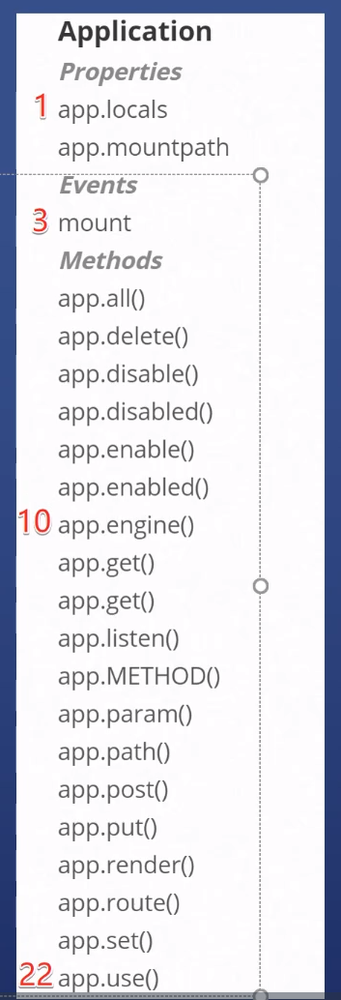

# 一些概念

子应用 

```js
const app = express() // 主应用
const admin = express()// 另一个应用

app.use('/admin', admin)  // admin 作为子应用
```

挂载点：'/admin' 就是admin的挂载点


# Express 提供的API
 
express.xxx 供7个api

1
- express() methods

2
- express.json() 如果发现请求的body是一个json，就会把json解析成对象 放到request.body 中
- express.raw() 类似json() 如果发现请求的body是一个二进制流，就会解析 放到request.body 中， 
- express.Router()
- express.static()
- express.text() 上传的是普通文本  body 就是文本

7
- express.urlencoded()

单词
- raw 未加工的、生的
- text 文本
- static 静态的
- encoded 编码过的

需要特别学习的API
- express.json()
- express.static()
- express.Router()


express.json()
```js

const express = require('express')
const app = express();

// 如果发现请求的body是一个json，就会把json解析成对象 放到request.body 中，
// 这样就没有on 'data' 事件了
app.use(express.json());

app.use((request, response, next) =>{
    console.log(request.body);
    response.send('hi')
    request.on('data', (chunk)=> {
        console.log('on data', chunk)
        console.log(chunk.toString());;
    })
    next()
});

app.listen(3000, () => {
    console.log('监听3000')
})

```

 express.static()

```js
// 设置静态服务器路径
app.use(express.static('yyy'))

```


express.Router() 暂时先不说，见后边


express.urlencoded(),
request header 是 x-www-form-urlencoded 时， 把请求的参数放到body里

参数类似 name=wsl&age=18
```js
const express = require('express')
const app = express();
app.use(express.urlencoded())
```


# app.xxx API

engine ： 引擎



需要特别学的
- app.set('views' | 'view engine')
- app.get('env')  获取env 值
- app.get('/xxx',fn)  处理get 请求
- app.post / app.put / app.delete  处理对应的http请求 
- app.render()
- app.use() 见express 核心


## app.set

[API](https://expressjs.com/zh-cn/4x/api.html#app.set)

```js

// 设置路径太小写敏感 必须最先设置 再使用中间件   
app.set('case sensitive routing', true)

// 设置渲染的视图在哪个目录,
app.set('views', 'views')
//设置模板引擎   
app.set('view engine', 'ejs')

app.get('/test', (req, res, next) => {
    // 渲染 views 目录下的 test.ejs 且设置 值
    res.render('test', {pageBody: 'wsl'})
})

```

```ejs
<!doctype html>
<html lang="en">
<head>
    <meta charset="UTF-8">
    <meta name="viewport"
          content="width=device-width, user-scalable=no, initial-scale=1.0, maximum-scale=1.0, minimum-scale=1.0">
    <meta http-equiv="X-UA-Compatible" content="ie=edge">
    <title>Document</title>
</head>
<body>
<%= pageBody %>
</body>
</html>
```

## get post put delete

```js

app.get('/test', (req, res, next) => {
    res.render('test', {pageBody: 'wsl'})
})

app.post('/test', (req, res, next) => {
    res.send('post test')
})

app.put('/test', (req, res, next) => {
    res.send('put test')

})

app.delete('/test', (req, res, next) => {
    res.send('delete test')

})
```


## app.render();

```js

app.get('/test', (req, res, next) => {
    res.render('test', {pageBody: 'wsl'})
})

```

## app.locals
本地的，局部的变量 

整个应用需要的变量，设置都local 上

```js
app.locals.title = 'my title'

app.get('/test', (req, res, next) => {
    res.render('test', {pageBody: app.locals.title})
})

```

中间件 读取locals.title

```js
// fn1.js
const fn1 = (request, response, next) =>{
    // 中间件 通过request.app.locals 拿到属性
    response.render('test', {pageBody: request.app.locals.title})
    // app.get set 也能拿到但是不推荐
    // response.render('test', {pageBody: request.app.get('myTitle')})
};

module.exports = fn1

```

```js
app.locals.title = 'my title'
// 不推荐
// app.set('myTitle', 'myTitle')

// app.js
const fn1 = require('./fn1')
app.use(fn1)


```


# req.xxx API

range: 范围
secure : 安全

[文档](https://expressjs.com/zh-cn/4x/api.html#req)

需要特别学习的

- req.get('Content-Type')  
- req.param('name')
- req.range()  [参考MDN](https://developer.mozilla.org/zh-CN/docs/Web/HTTP/Range_requests)
- [Neat](https://www.neatdownloadmanager.com/index.php/en/) 
下载，这个分块下载工具，对于一些下载较慢的大文件 下载起来比较方便，前提是资源服务器支持

  
## req.param

```

curl --location --request GET 'localhost:3000/users/1?name=wsl2'

```

```js
app.get('/users/:id', (request, response, next) =>{
    // 拿到查询参数name
    console.log(request.param('name')) // wsl
    // 拿到查询参数id
    console.log(request.param('id'))// 1
})
```


##  req.range() 

表示请求范围， 检测服务器是否支持范围请求


# response.xxx API 

[文档](https://expressjs.com/zh-cn/4x/api.html#res)

需要特别学习的
- res.send()  发送响应内容/ res.sendFile()  
- res.render()  渲染文件 / res.download() 快捷设置下载文件
- res.headersSent
- res.status()  设置状态码
- res.set() / res.get()  设置和获取请求头
- res.format()  根据不同类型返回不同内容
- res.vary()  与缓存有关  


```js

// 设置headers
response.set('token', 'xxxx');
// append 设置headers  可以追加一个一模一样的
response.append('token', 'xxxx2');

```


```js

  res.format({
        'text/plain': function () {
            res.send('hey')
        },

        'text/html': function () {
            res.send('<p>hey</p>')
        },

        'application/json': function () {
            res.send({ message: 'hey' })
        },

        default: function () {
            // log the request and respond with 406
            res.status(406).send('Not Acceptable')
        }
    })


```


# router.xxx API 


```js
// routes/blog.js
const {Router} = require("express");

const router = Router()


router.get('/', (req, res) => {
    res.send('list')
})

router.get('/:id', (req, res) => {
    res.send('a blog')
})


router.get('/:id/edit', (req, res) => {
    res.send('edit a blog')
})
module.exports = router


```


```js
const express = require('express')
const app = express();
const blog = require('./routes/blogs')
app.use('/blog', blog);
```


[代码 demo3](https://github.com/SealeyWang/express-demo3)

