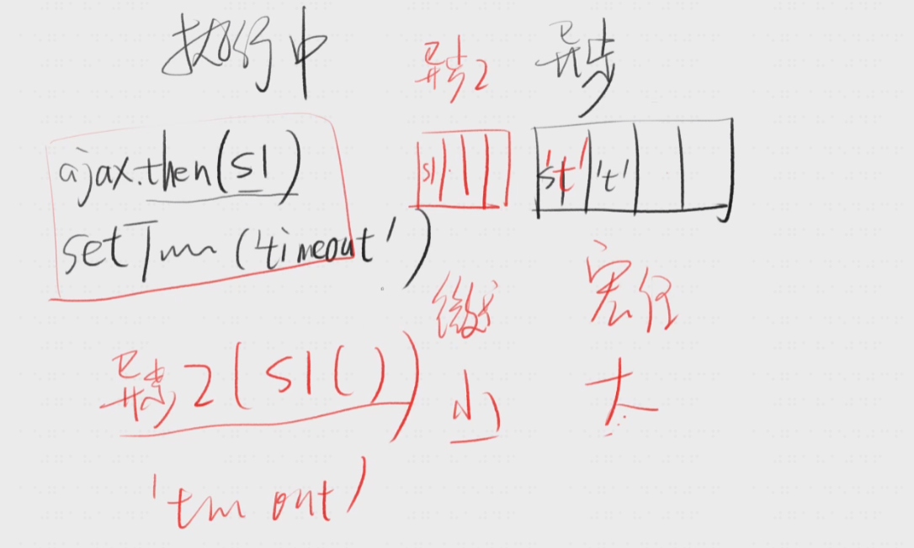

约定

- Promise 表示类
- promise 表示实例

基本用法
`const result = await promise ` 所以要先从 Promise 说起

# Promise

Promise三种状态

- pending 进行中
- fulfilled 已完成
- rejected 已失败

```js
// 摇色子函数
function roll() {
    return new Promise((resolve, reject) => {
        setTimeout(() => {
            resolve(Math.floor(Math.random() * 6) + 1)
        }, 3000)
    })
}


roll()
    .then(s1, f1)
    .then(s2, f2)


```



Promise API

```js
// 制造一个成功（或失败）
Promise.resolve(result)
// 制造一个失败
Promise.reject(reason)
//等待全部成功，或者有一个失败
Promise.all([promise])
// 等待第一个状态改变
Promise.race([promise])
// 等待全部状态改变
Promise.allSettled([promise])

```

Promise.resolve(result)

```js
function roll() {
    const x = 4
    return new Promise((resolve, reject) => {
        // 如果提前知道结果这样写 太麻烦
        resolve(4)
    })
}


function roll() {
    const x = 4
    return Promise.resolve(x)
}

roll().then(n => console.log(n))

```

Promise.reject(reason)

```js
Promise.reject('错了').then(null, (reason) => console.log(reason))
```

Promise.all([promise])

```js
Promise.all([Promise.resolve(1), Promise.resolve(2), Promise.resolve(3)])
    .then(values => console.log(values)) // [1,2,3]


Promise.all([Promise.reject(1), Promise.resolve(2), Promise.resolve(3)])
    .then(values => console.log(values), (reason) => console.log('失败' + reason)) // 失败1
```

Promise.allSettled([promise]) (API比较新，一些低版本浏览器、低版本node.js 不支持)
[兼容性参考](https://developer.mozilla.org/zh-CN/docs/Web/JavaScript/Reference/Global_Objects/Promise/allSettled)

```js

// 会把所有promise 的结果拿到 放到一个数组里， 使用成功回调resolve  

Promise.allSettled([Promise.reject(1), Promise.reject(2), Promise.resolve(3)])
    //[{"status":"rejected","reason":1},{"status":"rejected","reason":2},{"status":"fulfilled","value":3}]
    .then(values => console.log(JSON.stringify(values)), (reason) => console.log('失败' + reason))
```

自己实现 Promise.allSettled

```js

// - fulfilled 已完成
// - rejected 已失败


let alwaysSuccess = (promises) => {
    return promises.map(promise => promise
        .then(
            value => ({status: 'fulfilled', value}),
            // 失败也返回对象，这样promise 就不会失败了
            reason => ({status: 'rejected', reason})
        ))
}

const promise1 = () => new Promise((resolve, reject) => {
    setTimeout(() => reject('失败1'), 1000)
})
const promise2 = () => new Promise((resolve, reject) => {
    setTimeout(() => reject('失败2'), 2000)
})
const promise3 = () => new Promise((resolve, reject) => {
    setTimeout(() => resolve('成功3'), 3000)
})
const promises = alwaysSuccess([promise1(), promise2(), promise3()])

Promise.allSettled(promises)
    .then(results => console.log('allSettled', results))


// 挂到Promise上
Promise.allSettled2 = (promiseList) => {
    return Promise.all(alwaysSuccess(promiseList))
}
const mPromiseList = [promise1(), promise2(), promise3()]
Promise.allSettled2(mPromiseList).then(res => console.log('allSettled2', res));
```

## Promise应用场景

1.多次处理一个结果

roll.then(v => v1).then(v1 => v2)

## Promise 串行面试题

2.串行面试题
场景是输入框 输入后发送请求， 后输入的响应先接收到
例如： text1 text2 网络请求 ， text2的响应 比 text1 先回来

按理说只要按取消掉请求就可以， XMLHttpRequest.abort()  abort 对应的request即可，

但是面试的话，还是按照出题思路，使用队列按顺序处理请求

## Promise 错误处理

```js
// f1 就是reject 对应的错误处理函数
promise.then(s1, f1);

```

使用 语法糖catch
`promise.then(s1).catch(f1)`

# Async Await 代替 Promise

[Async/Await替代Promise的6个理由](https://blog.fundebug.com/2017/04/04/nodejs-async-await/)
比较靠谱的理由

- 简洁
- 其他的理由，Promise其实也能处理好

```js
const fn = async () => {
    const temp = await makePromise();
    return temp + 1
}
```

## 缺点

需要配合 Promise, 无法setTimeout

```js

async function task() {
    return Math.floor(Math.random() * 6) + 1
}

async function f1() {
    const result = await task()
    console.log(result);
    return result
}

// task 由于 JS语法， 能在setTimeout中 无法给task函数设置返回值，所以有setTimeout，还是需要Promise


function task() {
    return new Promise((resolve, reject) => {
        setTimeout(() => {
            resolve(Math.floor(Math.random() * 6) + 1)
        }, 3000)
    })
}

f1()

```

为什么函数要加async？

- 主要是为了兼用旧代码，普通函数里的 await(xxx)

## Async Await 错误处理

```js
try {
    const res = await axios.get('/xxx')
    console.log(res);
} catch (e) {
// 错误处理    
    if (e.res) {
        throw  e
    }
}


// 优化版本
const errorHander = (err) => {
    console.log(err);
}
// then 做错误处理 
const res = await axios.get('/xxx').then(null, errorHander)
console.log(res)

```

## Async Await 应用场景

多次处理一个结果

```js
const r1 = await makePromise()
const r2 = handleR1()
const r3 = handleR2()

```

串行
- 天生串行， await 执行后再执行一下个异步任务

串行陷阱 forEach 是并行的
```js
async function runPromiseByQueue(myPromises) {
  myPromises.forEach(async (task) => {
    await task();
  });
}

const createPromise = (time, id) => () =>
  new Promise((resolve) =>
    setTimeout(() => {
        // 1 2  4 
      console.log("promise", id); 
      resolve();
    }, time)
  );
runPromiseByQueue([
  createPromise(3000, 4),
  createPromise(2000, 2),
  createPromise(1000, 1)
]);

```

for是串行的
```js
async function runPromiseByQueue(myPromises) {
  for (let i = 0; i < myPromises.length; i++) {
    await myPromises[i]();
  }
}

const createPromise = (time, id) => () =>
  new Promise((resolve) =>
    setTimeout(() => {
        // 4 2 1
      console.log("promise", id);
      resolve();
    }, time)
  );
runPromiseByQueue([
  createPromise(3000, 4),
  createPromise(2000, 2),
  createPromise(1000, 1)
]);


```

并行

```js
// 这就是并行了
await Promise.all([p1, p2, p3])
```


刁钻题
```js
let a = 0
const f1 = async () => {
    /**
     * 通常 await 左边( a + ) 是 等右边(10)执行完去做 （异步），  
     * 但是运算符 +， 使其同步执行
     * 
     */
    a = (console.log(a), a) + await 10; 
    console.log(a)
}
f1() // 这里有坑
console.log(++a)

// 最终打印 0 1 10 

```
