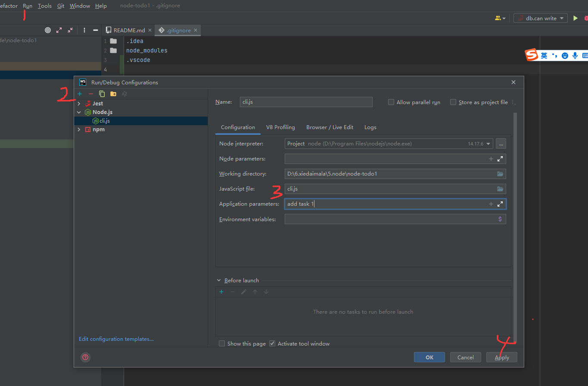
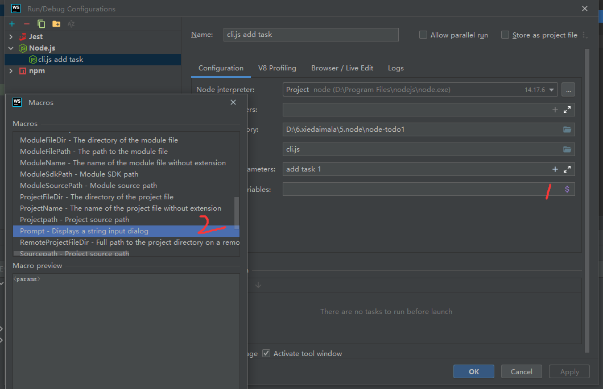
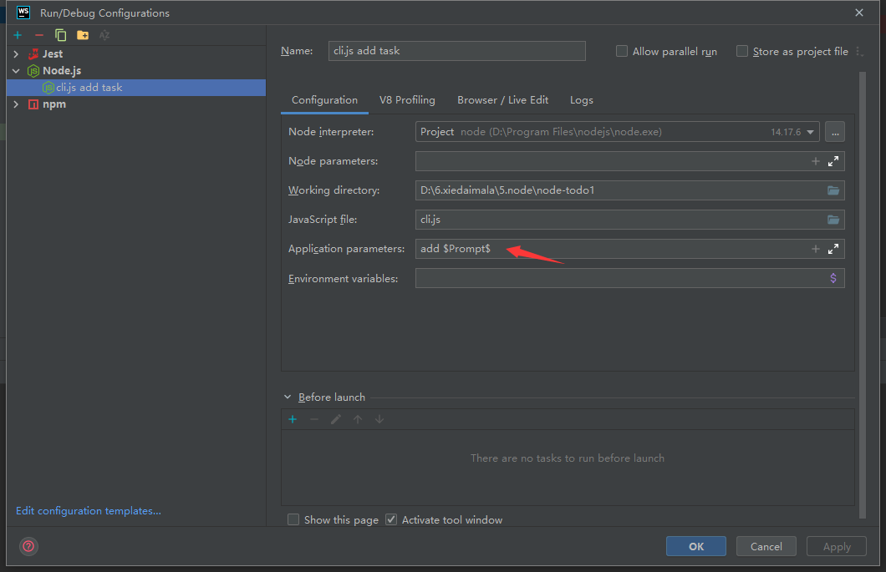
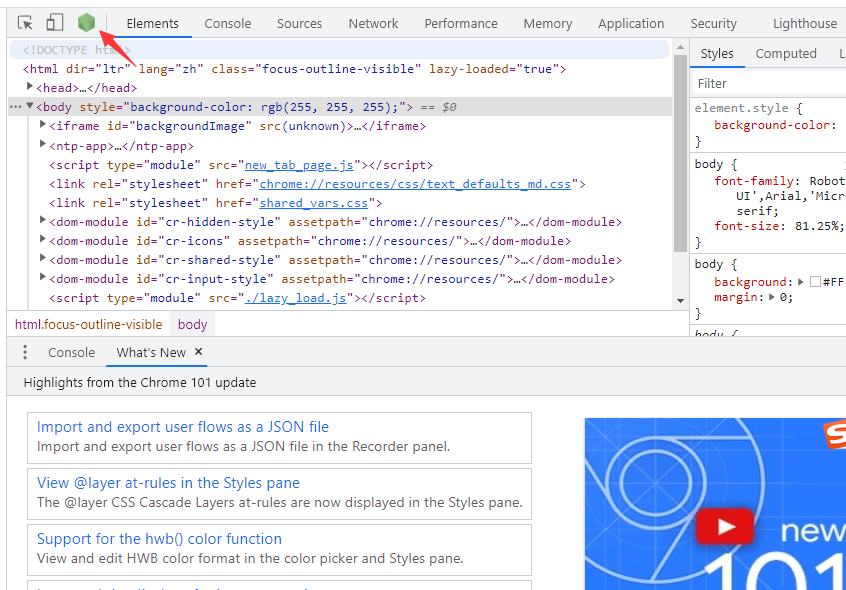

# WebStorm 调试 Node.js

run-> edit configurations -> 点加号 - 选 nodejs

在 Configuration 里
Name 是运行时对应的名字

- Node interpreter ： 选择 node.js 版本
- Node parameters : node 的参数（一般来说不需要参数）
- Working directory: 工作目录
- JavaScript File (主要是改这个): 想用哪个文件启动
- Application parameters: cli 后面接什么参数
- Environment variables: 环境变量参数，这里不用加



在对应的代码出打上断点， 然后 run -> Debug [name] 就好了

step over 执行这一行
setp into 进入这一行
setp out 退出到上次进入的行

## 配置输入的参数

点 Application parameters 后面的加号

选择 Prompt。 （可以让用户输入, 输入的值作为后续命令参数），再次运行时，就会弹窗提示输入了





# VsCode 如何调试

运行和调试 -> 创建 launch.json（选择 node 模板）-> 改好配置运行即可

launch.json 配置文件

```json
{
  // 使用 IntelliSense 了解相关属性。
  // 悬停以查看现有属性的描述。
  // 欲了解更多信息，请访问: https://go.microsoft.com/fwlink/?linkid=830387
  "version": "0.2.0",
  "configurations": [
    {
      "type": "pwa-node",
      "request": "launch",
      "name": "add task 200",
      "skipFiles": ["<node_internals>/**"],
      // 启动文件
      "program": "${workspaceFolder}\\cli.js",
      // 命令参数
      "args": ["add", "task", "200"]
    }
  ]
}
```

# 命令行和 Chrome 调试 Node.js

`node --inspect-brk cli.js add task 201`

-brk 默认不执行，会断开，需要手动点一下开始运行。 不过后续 http 程序不需要加，http 程序不会断开

启动后随便打开一个网页的开发者控制台点击按钮，打开 node 调试工具即可开始调试

