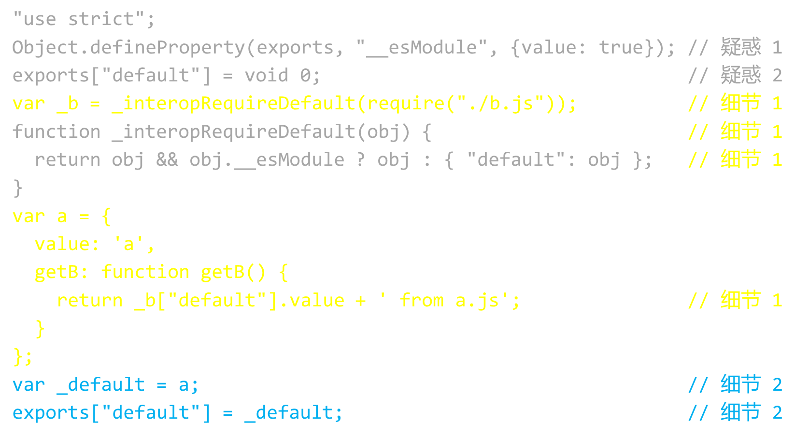

# Babel原理

- parse 把代码变成ast
- traverse 遍历ast修改
- generate 把ast变成代码

工具

- babel 可以把高级代码转译成es5
- @babel/parser
- @babel/traverse
- @babel/generator
- @babel/core 包含前三者
- @babel/preset-env 内置很多规则

babel 转译demo

```js
import {parse} from "@babel/parser"
import traverse from "@babel/traverse"
import generate from "@babel/generator"

const code = `let a = 'let'; let b = 2`
// code => ast
const ast = parse(code, {sourceType: 'module'})

// changfe ast
traverse(ast, {
    // 每进入一个节点 执行enter函数
    enter: item => {
        if (item.node.type === 'VariableDeclaration') {
            if (item.node.kind === 'let') {
                item.node.kind = 'var'
            }
        }
    }
})
// 通过ast 生成新的代码
const result = generate(ast, {}, code)
console.log(result.code)

```

## 把代码转为es5

```js
import {parse} from "@babel/parser"
import * as babel from "@babel/core"
import * as fs from 'fs'

const code = fs.readFileSync('./test.js').toString()
const ast = parse(code, {sourceType: 'module'})
const result = babel.transformFromAstSync(ast, code, {
    presets: ['@babel/preset-env']
})
fs.writeFileSync('./test.es5.js', result.code)

```

## js文件的 依赖分析

详见[代码](https://github.com/SealeyWang/AST-babel)

- 文件依赖
- 嵌套依赖
- 静态分析循环依赖

循环依赖

- 有的循环依赖可以正常执行，有的不可以
- 但是都可以做静态分析
  最佳实现： 最好别用循环依赖，以防万一

小技巧

- 哈希表存数据
- 检测key避免重复

# 打包 bundle （webpack的核心原理）


低版本流如何支持import / export？
- 把关键字转译为普通代码，把所有文件打包成一个文件
- 但是需要复杂的代码完成这件事，这个章节研究这件事

需要解决的问题
- 怎么把import / export 转成函数
- 平稳的兼容策略
  - 把关键字转译为普通代码
  - 把所有文件打包成一个

## 如何把 import / export 转成函数

@babel/core 已经做了

```js
// 获取文件内容，将内容放至 depRelation
const code = readFileSync(filepath).toString()
const {code: es5Code} = babel.transform(code, {
    presets: ['@babel/preset-env']
})
```

a.js

```js
import b from './b.js'

const a = {
    value: 'a',
    getB: () => b.value + ' from a.js'
}
export default a

```

a.js 转译后

```
 'a.js': {
    deps: [ 'b.js' ],
    code: '"use strict";\n' +
      '\n' +
      'Object.defineProperty(exports, "__esModule", {\n' +
      '  value: true\n' +
      '});\n' +
      'exports["default"] = void 0;\n' +
      '\n' +
      'var _b = _interopRequireDefault(require("./b.js"));\n' +
      '\n' +
      'function _interopRequireDefault(obj) { return obj && obj.__esModule ? obj : { "default": obj }; }\n' +
      '\n' +
      'var a = {\n' +
      "  value: 'a',\n" +
      '  getB: function getB() {\n' +
      `    return _b["default"].value + ' from a.js';\n` +
      '  }\n' +
      '};\n' +
      'var _default = a;\n' +
      'exports["default"] = _default;'
  },
```

a.js 的变化

- import 关键字变成 require()
- export 关键字 变成exports['default']
- code 是字符串



```js

//疑惑1
Object.defineProperty(exports, "__esModule", {
  value: true
});

// 疑惑2
exports["default"] = void 0;
// 细节1
var _b = _interopRequireDefault(require("./b.js"));
function _interopRequireDefault(obj) {
    return obj && obj.__esModule ? obj : {"default": obj};
}

var a = {
  value: 'a',
  getB: function getB() {
    return _b["default"].value + ' from a.js';
  }
};

// 细节2
var _default = a;
exports["default"] = _default;
```

疑惑1 
- 给当前模块添加  `__esModule:true` 属性， 方便跟CommonJS模块区分开
- 为啥不用 `exports.__esModule = ture' 赋值？ 
- 可以通过 `enumerable` 选项来切换， [源码](https://github.com/babel/babel/blob/e498bee10f0123bb208baa228ce6417542a2c3c4/packages/babel-helper-module-transforms/src/index.js#L215)
- exports.__esModule兼容性更好（IE），Object.defineProperty可能功能更强大吧，根据enumerable 的意思， Object.defineProperty 定义的也许是不能枚举，经过尝试 for in 循环，和Object.keys 无法获取__esModule 属性

疑惑2
- void 0  === undefined   返回true, 这是过时的技巧
- 强制清空`exports['default']`的值 


转译细节1
- `import b from './b.js'` 变成  `var _b = _interopRequireDefault(require("./b.js"));`
- `b.value` 变成 `_b['default.value]`


_interopRequireDefault(module)函数
- _下划线避免变量重名
- 给模块添加 'default'
- CommonJS模块没有默认导出，所以为了兼容加上
- 以_interop开头的函数大多是为了兼容旧代码. 
  - `var _b = _interopRequireDefault(require("./b.js"));` 
  - 可以理解成 `var _b = require("./b.js")`  

转译细节2
```js
// 目前来看没有特殊意义
var _default = a;
exports["default"] = _default;

//可以相当于 
exports["default"] = a;

// 例如
const x = 'x';
export {x} 
// 会变成
var x = 'x';
exports.x= x;
```


总结
- import 关键字变成require 函数
- export 关键字变成exports对象
- 本质是ESModule 语法变成 CommonJS 规则
- ES Modules 对模块采用了「动态只读引用」，而 CommonJS2 则是简单的浅复制
  - 关于 ES Module 和 CommonJS2 的区别，正确的有[参考文章](https://github.com/YvetteLau/Step-By-Step/issues/43#issuecomment-508682062)
- 后续在研究require函数

## 把多个文件打包成一个

目标：包含所有模块， 能执行所有模块（执行入口文件 or 第一个模块）

步骤
- DepRelation 变成数组
- code是字符串， 需要变成函数（遵循CommonJS2 的规则）
- execute函数待完善


DepRelation 变成数组， 具体对比bundler_1.js 和bundler_2.js
```ts
// 类型声明
type DepRelation = { key: string, deps: string[], code: string }[]
// 初始化一个空的 depRelation，用于收集依赖
const depRelation: DepRelation = [] // 数组！

//执行入口代码 第一项是入口
execute(depRelation[0].key)

// 然后执行
function execute(key) {
//    。。。。。。 
}
```


把code由字符串改为函数
- code字符串 外面包一个  ```function(require, module, epxorts){...}```
- 把code写到文件里，引号不会出现在文件里

例如
```js
let code = `
    var b = require('./b.js')
    exports.default= 'a'
` 
// require, module, exports  三个参数是CommonJS 2规范 规定的
let code2 = `function (require, module, exports) {
  ${code}
}`// 当前code2还是字符串 
// 把 {code: `${code2}`} 写入最终文件
// 最终文件里的code就是函数了
```


execute 函数思路
```js
const modules = {} // 用于缓存模块，  比如a模块 被多个其他模块使用， 缓存a可提高效率

function execute(key) {
  //  key => index.js a.js b.js 
  if(modules[key]){
      // 代码执行过 把导出的模块返回
      return modules[key]
  }
  var item = depRelation.find(i => i.key === key)
  var require = path => {
      return execute(pathTokey(path))
  }
  modules[key] = { __esModule: true} 
  // 兼容一些代码 不用细究
  var module = {exports: modules[key]}
  // 
  /**
   * @param require 执行当前代码时，如何执行其中的模块  例如： a.js 执行时， 如何执行其他模块
   * @param module.exports  是为了item.code（例如a.js 的代码） 在执行的时候，将该导出的属性 挂到 { __esModule: true} 对象上
   */
  item.code(require,  module, module.exports)//执行代码，并把导出模块 挂载 
  // 返回导出模块
  return modules[key]
}
```

如何生成bundle 文件 ?  => 拼接字符串  写入文件
- var dist = "";
- dist += content
- writeFileSync('dist.js',dist)


创建最终文件的关键代码，详见bundler_3.ts
```ts

writeFileSync('dist_2.js', generateCode())


function generateCode() {
  let code = ''
  code += 'var depRelation = [' + depRelation.map(item => {
    const { key, deps, code } = item
    return `{
      key: ${JSON.stringify(key)}, 
      deps: ${JSON.stringify(deps)},
      code: function(require, module, exports){
        ${code}
      }
    }`
  }).join(',') + '];\n'
  code += 'var modules = {};\n'
  code += `execute(depRelation[0].key)\n`
  code += `
  function execute(key) {
    if (modules[key]) { return modules[key] }
    var item = depRelation.find(i => i.key === key)
    if (!item) { throw new Error(\`\${item} is not found\`) }
    var pathToKey = (path) => {
      var dirname = key.substring(0, key.lastIndexOf('/') + 1)
      var projectPath = (dirname + path).replace(\/\\.\\\/\/g, '').replace(\/\\\/\\\/\/, '/')
      return projectPath
    }
    var require = (path) => {
      return execute(pathToKey(path))
    }
    modules[key] = { __esModule: true }
    var module = { exports: modules[key] }
    item.code(require, module, module.exports)
    return modules[key]
  }
  `
  return code
}

```

运行 node -r ts-node/register bundler_3.ts


bundler_3.ts 就是一个简易打包器 ， 也就是webpack 的核心内容

目前存在的问题
- 生成的 _interop函数xxx 重复
- 只能引入和运行js文件
- 只能理解import，无法理解require
- 不支持插件
- 不支持配置入口文件和dist文件名

[webpack-core代码](https://github.com/SealeyWang/webpack-core)


# loader

## 如何加载css?

思路
- 目前bundler只能加载js
- 把css变成js 


## style-loader 插入代码位置有问题
style-loader
- 它是插入代码，不是转译，需要寻找插入时机、位置
  - 时机应该是获取css-loader的结果之后
  - 位置在原代码下面

style-loader.js
```js
/**
 * 目前是有问题，无法随意插入代码 ，可参考webpack style-loader的思路
 */

const transform = code => `
if(document){
  const style = document.createElement('style')
  style.innerHTML = ${JSON.stringify(code)}
  document.head.appendChild(style)
}
`

// const transform = code => `
// ${code}
// if(document){
//   const style = document.createElement('style')
//   style.innerHTML = ????? 不知道导出的变量引用，
//   document.head.appendChild(style)
// }
// `
module.exports = transform


```

webpack style-loader 思路
- style-loader 在pitch钩子里通过css-loader 来require 文件内容
- 在文件内容后面添加 injectStyleIntoStyleTag(content,...)代码


## 阅读style-loader源码  理解webpack 

看源码思路
- 直接看效率太低
- 应该带着问题看源码
  - 先大胆假设 再看源码小心求证
- 当自己的思路无法满足需求的时候，去看别人的实现， 这样才会成长

```js
   return `${
        esModule
          ? `import api from ${loaderUtils.stringifyRequest(
              this,
              `!${path.join(__dirname, 'runtime/injectStylesIntoStyleTag.js')}`
            )};
            import content${
              namedExport ? ', * as locals' : ''
            } from ${loaderUtils.stringifyRequest(this, `!!${request}`)};`
          : `var api = require(${loaderUtils.stringifyRequest(
              this,
              `!${path.join(__dirname, 'runtime/injectStylesIntoStyleTag.js')}`
            )});
            var content = require(${loaderUtils.stringifyRequest(
              this,
              `!!${request}`
            )});

            content = content.__esModule ? content.default : content;`
      }

var options = ${JSON.stringify(runtimeOptions)};

options.insert = ${insert};
options.singleton = ${isSingleton};

var update = api(content, options);

${hmrCode}

${
  esModule
    ? namedExport
      ? `export * from ${loaderUtils.stringifyRequest(this, `!!${request}`)};`
      : 'export default content.locals || {};'
    : 'module.exports = content.locals || {};'
}`;
```


思考:图片的引用要用什么loader? 工作原理是什么？    

```js
import logo from './img/logo.png'

React: 
```

最少两种思路 
- 大尺寸返回相对路径
- 小尺寸返回base64编码

## raw-loader  
加载任意文件

```js
// 引入工具
import { getOptions } from 'loader-utils';
import { validate } from 'schema-utils';

// 参数描述文件
import schema from './options.json';

// 导出函数
export default function rawLoader(source) {
    // 获取配置项
  const options = getOptions(this);

  // 验证options是否合法
  validate(schema, options, {
    name: 'Raw Loader',
    baseDataPath: 'options',
  });

  // JSON   两个特殊字符需要转译
  const json = JSON.stringify(source)
    .replace(/\u2028/g, '\\u2028')
    .replace(/\u2029/g, '\\u2029');

  const esModule =
    typeof options.esModule !== 'undefined' ? options.esModule : true;

  return `${esModule ? 'export default' : 'module.exports ='} ${json};`;
}
```

[JSON 特殊符号转译参考](https://github.com/nodejs/node-v0.x-archive/issues/8221)

## css-loader 

```js

 const importCode = getImportCode(imports, options);
  const moduleCode = getModuleCode(result, api, replacements, options, this);
  const exportCode = getExportCode(exports, replacements, options);

  callback(null, `${importCode}${moduleCode}${exportCode}`); 
```

```js

function getModuleCode(result, api, replacements, options, loaderContext) {
  if (options.modules.exportOnlyLocals === true) {
    return '';
  }

  const sourceMapValue = options.sourceMap
          ? `,${normalizeSourceMapForRuntime(result.map, loaderContext)}`
          : '';

  /**
   * 关键代码  把css code stirng化 （加上""） 
   * @type {string}
   */
  let code = JSON.stringify(result.css);

  let beforeCode = `var ___CSS_LOADER_EXPORT___ = ___CSS_LOADER_API_IMPORT___(${
          options.sourceMap
                  ? '___CSS_LOADER_API_SOURCEMAP_IMPORT___'
                  : 'function(i){return i[1]}'
  });\n`;

  for (const item of api) {
    const { url, media, dedupe } = item;

    beforeCode += url
            ? `___CSS_LOADER_EXPORT___.push([module.id, ${JSON.stringify(
                    `@import url(${url});`
            )}${media ? `, ${JSON.stringify(media)}` : ''}]);\n`
            : `___CSS_LOADER_EXPORT___.i(${item.importName}${
                    media ? `, ${JSON.stringify(media)}` : dedupe ? ', ""' : ''
            }${dedupe ? ', true' : ''});\n`;
  }

  for (const item of replacements) {
    const { replacementName, importName, localName } = item;

    if (localName) {
      code = code.replace(new RegExp(replacementName, 'g'), () =>
              options.modules.namedExport
                      ? `" + ${importName}_NAMED___[${JSON.stringify(
                              getValidLocalName(
                                      localName,
                                      options.modules.exportLocalsConvention
                              )
                      )}] + "`
                      : `" + ${importName}.locals[${JSON.stringify(localName)}] + "`
      );
    } else {
      const { hash, needQuotes } = item;
      const getUrlOptions = []
              .concat(hash ? [`hash: ${JSON.stringify(hash)}`] : [])
              .concat(needQuotes ? 'needQuotes: true' : []);
      const preparedOptions =
              getUrlOptions.length > 0 ? `, { ${getUrlOptions.join(', ')} }` : '';

      beforeCode += `var ${replacementName} = ___CSS_LOADER_GET_URL_IMPORT___(${importName}${preparedOptions});\n`;
      code = code.replace(
              new RegExp(replacementName, 'g'),
              () => `" + ${replacementName} + "`
      );
    }
  }

  return `${beforeCode}// Module\n___CSS_LOADER_EXPORT___.push([module.id, ${code}, ""${sourceMapValue}]);\n`;
}
```

总结
- this.async()用于获取回调
- github 代码跳转快捷键ctrl+f


### 自己写一个webpack loader

步骤
- 按照[文档](https://webpack.js.org/contribute/writing-a-loader/)初始化项目
- copy  paste modify
- 有问题参考 [writing loader][https://webpack.js.org/contribute/writing-a-loader/]
- 测试
- 发布npm
- 项目里使用  (建议实现markdown-loader)


### loader 面试题


webpack loader 是什么？
- webpack自带的打包器只能支持JS文件
- 当想要加载 css,les,scss,stylus,ts,md 文件时，就需要用loader
- loader的原理就是把文件内容包装成能运行的js
- 比如 加载css 需要用到style-loader  和  css-loader
- 由于单一职责原则 css-loader 把代码从css代码变成  export default str形式的js 代码
- style-loader 把代码挂载到head里的style标签里
- 如果没有深入了解，不要提 style-loader 用到了pitch钩子和request对象


高级前端的回答方式
- 写过一个简单的loader （如markdown loader） 放到github上，可以看一下 （没写过，  快去写吧）
- 如果要问原理，就把代码思路说一遍
- 然后时候自己的 loader  和webpack 推荐的loader 区别在哪里 （说缺点，少哪些功能，）目前能满足需求 没加


# webpack 源码


