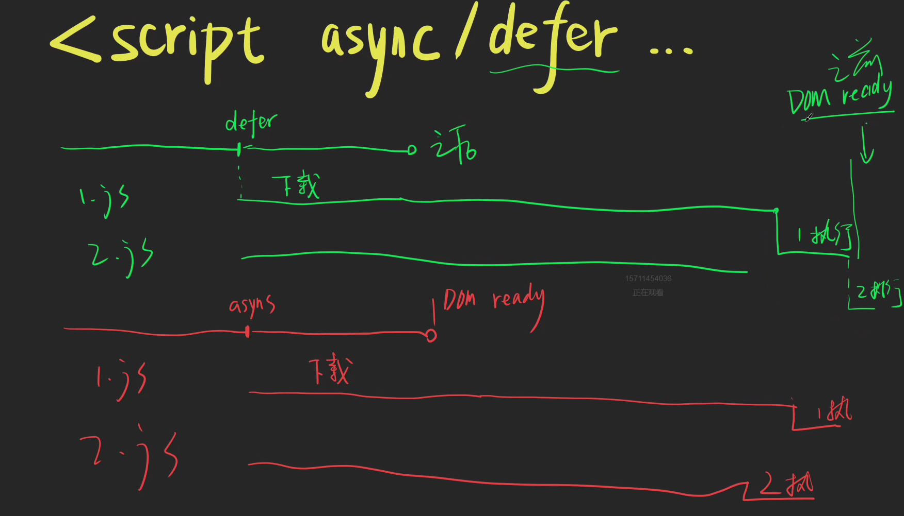

# 浏览器渲染原理


- html 可以边下载变解析，也可以全部下载完再解析 具体看浏览器实现
    - html解析时发现link了css 会去下载和解析，和html一样边下载边解析 或 下载完解析看浏览器实现
    - css的下载和解析不会阻塞html的解析

- js的下载和执行会阻塞html的解析, 为什么？下载和执行会导致dom树的修改
    - 执行js可能会修改dom树
    - html解析到script标签才会去下载，下载一旦下载就必须等js执行完毕 （理论上可以预先开始下载，不过优化的时机，和下载耗时比没有必要）

- css的下载和解析会阻塞js的执行 （js需要读取css的结果）

## script 标签加 async 和 defer 的区别



相同点
html解析时，在发现async 和 defer 之后 继续去 解析html, 然后下载

defer: 是等js下载完成后，按顺序执行， 执行完后触发dom ready
async: 下载完就去执行，不保证顺序， 且html解析完后就去执行dom ready，
完全和html解析没关系，适合做一些不和dom有关的操作

## 页面渲染原理

dom树，css树-> 渲染树-> 布局 layout-> 绘制Paint-> 合成composite->

- 布局： 计算元素大小尺寸 位置， 当前屏幕展示的内容
- 绘制： 填充颜色 阴影等
- 合成： 把多层次的内容合并成一个层次

避免 reflow （重新布局） repaint（重新绘制）
一般 reflow 了也会 repaint
参考 [csstriggers](https://csstriggers.com/) ， 一些css属性会触发 reflow、repaint

常用的 用transform 代替 left

# 性能检测工具

- network面板 查看页面时间线
- performance面板 查看js执行性能
- rendering面板 查看页面渲染
- coverage 查看代码使用率
- lighthouse 查看性能优化建议

## network面板

- DOMContentLoaded 是domready 事件触发，
- load 表示主要资源被下载

waterfall 关键指标

- request 把整个请求内容发送完成的时间
- waiting 是等待后端相应的时间
- content download 是内容下载时间

# web性能指标

用户按下回车 到

- 有内容出现
- （重点） DomReady事件发生 （DomContentLoaded）,
    - 代表html内容全部解析完，js基本执行完
    - 不保证图片和css样式加载完成
- 页面可交互 （用户可点击）
- onLoad事件发生 （所有图片 和样式加载完成）
- 动态资源加载完成 （包括懒加载 和 动态加载的内容 一般不用这个指标）

# DNS优化

DNS预解析 pre-fetch

index.html 的<head> 里加上
`<link rel="dns-prefetch" href="https://a.com/">`

在index.html 的响应头里加上

```
Link: <https://a.com/>; rel=dns-prefetch 
```

```HTML
<!--index.html-->
<!doctype html>
<html lang="en">
<head>
    <meta charset="UTF-8">
    <meta name="viewport"
          content="width=device-width, user-scalable=no, initial-scale=1.0, maximum-scale=1.0, minimum-scale=1.0">
    <meta http-equiv="X-UA-Compatible" content="ie=edge">
    <title>Document</title>

    <!--    head标签里 加上DNS 预解析 -->
    <link rel="dns-prefetch" href="https://a.com/">
    <link rel="dns-prefetch" href="https://b.com/">
</head>
<body>

<!--解析a.com  下载1.js 并执行-->
<script src="https://a.com/1.js"></script>
<!-- a.js 执行完成后， 才去解析 b.com 并去下载2.js 执行-->
<script src="https://b.com/2.js"></script>
</body>
</html>

```

# TCP 优化

## 链接复用

http 的请求头和响应头都加上 `Connection:keep-alive`

`KeepAlive:timeout=5,max=1000`

- 设置超时时间，5秒后还没有请求 则关闭TCP链接。 max=100 最多处理1000个请求
- 请求头和响应头都可以加，一般情况下浏览器以响应头为准
- HTTP/1.1 是会自动加Connection:keep-alive 的

## 并发链接

把合并后，过大的css js 拆分（一把拆成3~4个文件），这样可以让它们并行下载

## http管道化 -> HTTP/2

http管道化是一个TCP连接发送多个http请求

但是有bug的， 响应的顺序需要和请求的顺序一致（网络会波动，HTTP/1.1，做不到没有类似请求id的）

例如 1 2 3 个请求 2 需要等1 的响应， 还不如链接复用 + 并发请求

HTTP/2 解决了这个问题

http2 引入了帧（frame）的概念

- 每一帧包含 Length Type Flags StreamID (9字节) Payload (16k ~ 16mb)
- 保留请求和响应的概念， 请求头和响应头会被发送方压缩后，分成几个连续的frame传输（需要保证次序），
- 头字段在 frame 的 Payload中， 接收方收到frame 拼接、解压缩 可以得到真正的请求头和响应头

http2 引入了流（stream）的概念

- 一个stream 由双向传输、连续且有序的frame组成， 一个TCP连接可以同时包含多个stream(100个都算少)，
- 一个stream只用于一次请求和响应，stream之间不会互相影响

header 的变动

- header字段变为小写，禁止大写 accept:text/html
- 引入伪头部字段概念， 出现在头部字段的前面，必须以冒号靠头：比如:method:GET

新功能Server push (很少用)

- 服务端可以预先发响应， 客户端拿到响应后保存，就不需要再发对应的请求了
- 但是这个功能配置会比较麻烦，需要服务端配置 想要的推送接口，用的比较少

Nginx 配置server push
访问根目录 推送 style.css example.png 文件

```
location / {
    root /usr/share/nginx/html;
    index index.html index.htm;
    http2_push /style.css;
    http2_push /example.png;
}

```

上班要经常改nginx配置，太麻烦

另一种方法是Server端在index.html响应头里加

```http request
Link: </style.css>;rel=preload;as=style

```

这样也很麻烦， 应为目前大多是webpack 生成带hash的文件，也要频烦的改，所以放弃不用

# HTTP/1.1 协议下的优化

## 资源合并

- css 雪碧图(sprites 精灵)
- Icon Font
- SVG Symbols (推荐，支持渐变 编辑方便)

[阿里矢量图标库](https://www.iconfont.cn/)

## 资源内联

使用webpack 实现

- 小图片 ->  data url
- 小css文件 -> <style> 代码 </style>
- 小js 文件 -> <script> 代码 </script>

## 资源压缩 （gzip）

响应传给浏览器之前 先把响应压缩成gzip包， 浏览器拿到之后解压缩

nginx 在配置文件里加

`gizp on` 开启gzip

`gzip_types text/plain application/xml` 设置需要压缩的文件类型

`gzip_min_length 1000;` 小于多少不压缩

apache 大多数情况是后端做， [参考](https://ubiq.co/tech-blog/enable-gzip-compression-apache/)

node.js [参考](https://nodejs.org/api/zlib.html)

官方文档的样例，在请求是获取 支持的 accept-encoding，判断使用那种压缩算法，

不过每次请求都压缩有点浪费时间，可以优化 比如

- 压缩后缓存，对比文件hash。
- 启动时Server压缩把文件压缩好，直接获取压缩文件

```js
// server example
// Running a gzip operation on every request is quite expensive.
// It would be much more efficient to cache the compressed buffer.
const zlib = require('node:zlib');
const http = require('node:http');
const fs = require('node:fs');
const {pipeline} = require('node:stream');

http.createServer((request, response) => {
    const raw = fs.createReadStream('index.html');
    // Store both a compressed and an uncompressed version of the resource.
    response.setHeader('Vary', 'Accept-Encoding');
    let acceptEncoding = request.headers['accept-encoding'];
    if (!acceptEncoding) {
        acceptEncoding = '';
    }

    const onError = (err) => {
        if (err) {
            // If an error occurs, there's not much we can do because
            // the server has already sent the 200 response code and
            // some amount of data has already been sent to the client.
            // The best we can do is terminate the response immediately
            // and log the error.
            response.end();
            console.error('An error occurred:', err);
        }
    };

    // Note: This is not a conformant accept-encoding parser.
    // See https://www.w3.org/Protocols/rfc2616/rfc2616-sec14.html#sec14.3
    if (/\bdeflate\b/.test(acceptEncoding)) {
        response.writeHead(200, {'Content-Encoding': 'deflate'});
        pipeline(raw, zlib.createDeflate(), response, onError);
    } else if (/\bgzip\b/.test(acceptEncoding)) {
        response.writeHead(200, {'Content-Encoding': 'gzip'});
        pipeline(raw, zlib.createGzip(), response, onError);
    } else if (/\bbr\b/.test(acceptEncoding)) {
        response.writeHead(200, {'Content-Encoding': 'br'});
        pipeline(raw, zlib.createBrotliCompress(), response, onError);
    } else {
        response.writeHead(200, {});
        pipeline(raw, response, onError);
    }
}).listen(1337);
```

## 代码精简

使用webpack插件做代码精简

- html 删空格， 删闭合
- js 改名，例如使用uglify.js 把长的变量名变成a,b,c 这种 压缩js代码
- svg 插件删无用标签属性
- 图片 减少体积，使用有损、无损压缩。

## 优化Cookie

Cookie 大小可以到4k 每次请求都会带上，最好只用做认证，存数据的话用 localStorage SessionStorage

启用新域名，不会带上cookie，同时还实现了连接并发（域名越多，同时下载的资源数量就越多）    
术语cookie-free(无cookie )

用新域名的好处是什么？ cookie-free

## CDN 内容分发网络

DNS 负载均衡， ping 域名 返回不同的ip， 多个ip 多个服务器做相同的服务

如何上传文件到 CDN?

- 花钱买cdn服务
- 发布时用命令行上传文件 (CDN 服务商提供)
- 改html 使用cdn域名下的资源文件

```html
<!-- 使用 服务器资源-->
<script src="./a.js"></script>
<!-- 使用CDN资源-->
<script src="https://cdn1.com/a.js"></script>
```

优点

1. cookie free
2. 并行请求/多路复用 （如果cdn使用了http2 ）
3. 下载速度快（只需要处理静态资源）

缺点

1. 要钱
2. 部署复杂 学一下
3. 可控性差 大公司自己搭建cdn服务， 小公司可能就是缺点
4. 跨域 使用CORS解决

DNS 会出现什么样的跨域问题？

- Canvas 虽然可以加载跨域图片，但是在调用 getImageData() toBlob() toDataURL() 时会产生报错，
- 解决办法是启用 CORS 头，并给图片添加 crossorigin=anonymous 属性。详见 MDN
- window.addEventListener('error', ...) 无法捕获跨域 JS 的错误详情。 解决办法有两个，
    - 一个是启用 CORS 头并给 script 标签添加 crossorigin=anonymous 属性，
    - (我在协同编辑 项目接入sentry 的时候用到过， 引入sentry的js文件时加上了 crossorigin=anonymous属性)
    - 另一个比较开脑洞，是重写 addEventListener，[解决 "Script Error" 的另类思路](https://juejin.cn/post/6844903727820718094)
    - 文章也是参考sentry io 的 [blog](https://blog.sentry.io/2016/01/04/client-javascript-reporting-window-onerror)

简单来说

- 改写了 EventTarget 的 addEventListener 方法；
- 对传入的 listener 进行包装，返回包装过的 listener，对其执行进行 try-catch；
- 浏览器不会对 try-catch 起来的异常进行跨域拦截，所以 catch 到的时候，是有堆栈信息的；
- 重新 throw 出来异常的时候，执行的是同域代码，所以 window.onerror 捕获的时候不会丢失堆栈信息；

.gz 文件是什么？是预先压缩好的gz 文件， 会优先使用

Nginx 提供了2种gzip模式

gzip on; 每次请求时压缩文件，有点占用cup，增加请求时间

gzip_static on;

- 会在请求 /path/to/file 时。主动找/path/to/file.gz 作为压缩版本（程序员预先压缩的），找不到就直接返回未压缩的版本
- 优先级更高，但是不是Nginx 的默认功能，需要在编译时添加扩展选项

协同编辑时性能优化有用到预压缩，原先一些js资源文件是在请求时压缩，
太多资源文件，和并发导致cpu占用高响应慢，方案是在server启动时，压缩js文件,优化后响应时间降低了3~4s

# Http 缓存与内容协商

俗称 强缓存 与 弱缓存

`Cache-Control:public,max-age=3600,must-revalidate`

public 公开内容

max-age=3600 缓存时间

must-revalidate （过期的缓存）必须重新校验， -> 缓存 继续使用 or 丢弃

## 内容协商

协商的是缓存过期后能重用吗？

ETag:ABCxxx 值一般为文件hash

如果-没有-匹配

If-None-Match: ABCxxx

当cache-control 过期 请求服务器 对比ETag的值 没改变 返回304 not modify


## 禁用缓存

### 服务器禁用

不加 Cache-Control，浏览器还会缓存1.js吗

会， get 请求一一般会被缓存

`Cache-Control:max-age=0,must-revalidate` 到达浏览器立刻失效，可以用于内容协商

MDN 说 相当于`Cache-Control:no-cache`

内容协商也禁用 `Cache-Control:no-store` 不能缓存，也不能内容协商

### 浏览器禁用

如果get 请求/users 设置了缓存 如何禁用

- 加随机数规避 /users?xxx ，url不一样会跳过缓存
- 请求头设置 `Cache-Control:no-cache,no-store,max-age=0`

pragma:no-cache 用来兼容 只支持http/1.0协议的缓存服务器

# 代码优化

## 代码位置

css 放到 <head> 里 让用户先看到界面

- 不阻塞html解析，尽早下载
- 防止被外部js阻塞 白屏（几率多） 或闪烁 具体看浏览器 和 代码位置

外部 js 放到body最后面, 用户操作网页比看 慢

- 直接访问DOM 无需监听DOM Ready
- 避免js 阻塞html解析

内联js 放到css前面

- 无需下载 尽快执行完 再去下载css

## 代码拆分

把不经常变动的代码 打包成 几个js 文件， 经常变动的代码单独拎出来打包成一个，
这样改动后就只需要重新下载一小部分，不经常改动的代码缓存未失效

参考

js

- runtime-xxx.js webpack 自带的，import 改成require 运行时函数, 升级webpack的时候会变， 如果比较小可以写成内联
- vendor-xxx.js 第三方库 例如 Vue Vuex React React Router
- common-xxx.js 公司级的基础库
- page-index-xxx.js 每个页面的js

css

- reset/normalize.css
- vendor-xxx.css
- common-xxx.css
- page-admin-xxx.css 每个页面的css

配置webpack 做拆分

## 动态导入

js 太大首页 加载慢

- 把js拆分成 首页.js other.js  (缺点，首页补卡，后面可能卡)

```js
// 动态导入lodash
const arr = [1, 2, 3]
import('lodash').then(_ => {
    const clone = _.cloneDeep(arr);
})
```

```js
// 动态导入组件
const router = new VueRouter({
    routes: [
        {path: '/home', component: () => import('./Home.vue')},
        {
            path: '/about',
            component: () => ({
                component: import('./About.vue'),
                loadding: LoaddingComponent,
                error: ErrorComponent
            })
        }

    ]
})

```

```js
import React, {Suspense, lazy} from 'react'
import {BrowserRouter as Router, Route, Switch} from 'react-router-dom'

// 用lazy函数构建动态组件
const Home = lazy(() => import('./routes/Home'))
const Home = lazy(() => import('./routes/About'))

const App = () => (
    <Router>
        // Suspense 组件包含Switch  会在访问路径时 动态加载组件   fallback 是loading 组件
        <Suspense fallback={LoadingComponent}>
            <Switch>
                <Route  exact path="/" component={Home} />
                <Route path="/about" component={Home} />
            </Switch>
        </Suspense>

    </Router>
)

```

## 图片懒加载


```html


```

伪代码 
- 滚动时 找到all img
- 拿到每个img 真实图片url, 创建一个新的Image 对象去请求图片， 当请求完成，替换到原来的 img.src上 
``` 
window on scroll
findImages.each img 
 new Image()
         .src= img.dataset.src
.onload img.src = img.dataset.src
```

## 预加载
提前加载

## css代码优化
- 删除无用css 可以使用webpack 插件，（这个事费力，效果小，容易出错 不推荐做）
- 使用高效的选择器  正常使用就行 只要不是 * > span > *, 一般不会有问题
- 减少重排    .left 动画 替换成 transform （比较有用）  
- 不要使用@import url.css 因为不能并行，只能按顺序串行加载
- 启用GPU硬件加速 transform: translate3d(0,0,0) 
- 使用缩写 #FFFFFF => #FFF  0.1 => .1    0px => 0 webpack就可以做这件事
- 砍需求 最有用

## js优化

- 尽量不用全局变量， （因为全局变量太多会使变量查找慢）
- 尽量少操作DOM （可以用Fragment 一次插入多个DOM节点）
- 不要往页面中插入大量的HTML （一定会卡） innerHtml = 'xx 大量html '    所以分多次插入 
  - [react fiber架构](https://juejin.cn/post/6993973502852202503) 就是解决这种问题 （分批插入DOM）
  - 中途数据变了咋办 需要concurrent 模式，可以参考 [理解 React Fiber & Concurrent Mode](https://zhuanlan.zhihu.com/p/109971435)
  - 总的来说是模拟操作系统的时间分片，把一个长任务变成10个（n个）小任务，每个小任务都可以后续去异步操作
  - 在js里就是 setTimeout & requestAnimationFrame
- 尽量减少触发重排， （可以使用节流和防抖来降低重排频率）
- 尽量少用闭包，避免内存泄漏（实际是浏览器的bug）
- 长列表使用虚拟滚动列表 (不过实践中大多分页)
