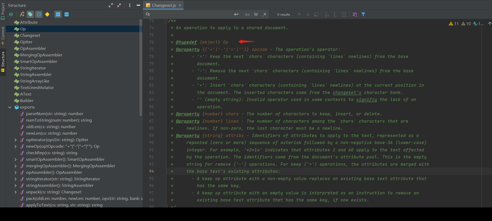

# easysync 算法是干嘛的

在多人写作文档中 easysync 算法是用来解决多人编辑的冲突的问题

首先，科普下专利的重要性，easysync 这套算法，作者是申请了专利的。

专利地址：http://www.freepatentsonline.com/y2012/0110445.html

作者的 LinkedIn 页面：http://www.linkedin.com/in/aaroniba/
作者当年从 Google 离职之后创业开创了 etherpad 公司，核心算法就是这套算法，之后，被 Google 收购为开源项目。而 etherpad 是在 Apache 协议下开源的，所以我们能够使用相关的专利。

## etherpad-litter

etherpad-litter 基于 nodejs 实现 用于代替原 etherpad（ scala，java，js 实现）
repo https://github.com/ether/etherpad-lite

[参考 在线文档中 Easysync2 算法介绍](https://slix.rocks/%E5%9C%A8%E7%BA%BF%E6%96%87%E6%A1%A3%E4%B8%AD-easysync2-%E7%AE%97%E6%B3%95%E4%BB%8B%E7%BB%8D/)

# AText

AText = text + attribs 用于描述完整的文档内容


内容对应的 atext (atext 使用 36 进制， 需要结合下边的 apool 看)

```
atext= { text: '\n\nxx\nyyy\n', attribs: '*0|2+2*0*7+2*0|1+1*0*i+3|1+1' }
```

\*0 是用户属性

\*0|2+2 表示 用两个字节换 2 行，带有用户属性 （表示\n\n 两个换行符，且有用户属性）

\*7 是 ib_bold 属性

\*0\*7+2 两个字节（xx）带有 author 和 ib_bold 属性

\*0|1+1 xx 后换行 不多说了

\*i 对应 ibStrikethrough 属性 (十进制 18)

\*0\*i+3 对应 yyy 有 author 和 ibStrikethrough

|1+1 表示换行 （代表一个换行符 \n）

## Apool

属性池， 文档中出现过的所有格式

```

apool= AttributePool {
  numToAttrib: {
    '0': [ 'author', 'a.nQtf9mShqVxHbbPS' ],
    '1': [ 'ibBreakLine', 'ibBreakLine' ],
    '2': [ 'insertorder', 'first' ],
    '3': [ 'lmkr', '1' ],
    '4': [ 'ibAbstractBreak', 'true' ],
    '5': [ 'bold', 'true' ],
    '6': [ 'color', 'rgb(47,48,51)' ],
    '7': [ 'ib_bold', 'true' ],
    '8': [ 'color', 'rgb(0,0,0)' ],
    '9': [ 'bold', '' ],
    '10': [ 'ib_bold', '' ],
    '11': [ 'heading', 'h1' ],
    '12': [ 'heading', 'h2' ],
    '13': [ 'heading', 'h3' ],
    '14': [ 'color', 'var(--text-color)' ],
    '15': [ 'ibUnderline', 'true' ],
    '16': [ 'ibUnderline', '' ],
    '17': [ 'underline', '' ],
    '18': [ 'ibStrikethrough', 'true' ]
  },
  attribToNum: {
    'author,a.nQtf9mShqVxHbbPS': 0,
    'ibBreakLine,ibBreakLine': 1,
    'insertorder,first': 2,
    'lmkr,1': 3,
    'ibAbstractBreak,true': 4,
    'bold,true': 5,
    'color,rgb(47,48,51)': 6,
    'ib_bold,true': 7,
    'color,rgb(0,0,0)': 8,
    'bold,': 9,
    'ib_bold,': 10,
    'heading,h1': 11,
    'heading,h2': 12,
    'heading,h3': 13,
    'color,var(--text-color)': 14,
    'ibUnderline,true': 15,
    'ibUnderline,': 16,
    'underline,': 17,
    'ibStrikethrough,true': 18
  },
  nextNum: 19
}

```

# Changeset 下面简称 CS

一个 changeset 如下所示

`Z:5g>1|5=2p=v*4*5+1$x ` 基于 36 进制

`Z` 是'magic character' 格式版本识别码

`:5g>1|5=2p=v*4*5+1` 一系列符号，简称为操作码（operation codes or 'opcodes'） 和 字母数字（基于 36 进制）
应该是指
上述出现的操作码有

- `:` 如：`:5g`
- `>` 如：`>1`
- `|` 如：`|5`
- `=` 如：`=2p =v`
- `*` 如：`*4 *5`
- `+` 如：`+1`

`$` 用于分隔 之后的字符 叫“char bank” 是 CS 的

**$之后的字符** 用于插入操·作，叫 "char bank"， 也许一次 CS 插入的字符， 都是顺序从'char bank'中取出来的。包括换行符

把 36 进制的数字 `Z:5g>1|5=2p=v*4*5+1$x `

转换为 10 进制的数字 `Z :196 >1 |5=97 =31 *4 *5 +1 $x`

操作描述， N 代表变量

:N 是源文本的长度为 N, 必须是第一个操作

`>N` 最终文本比源文本长 N 必须是第二次操作

`<N` 最终文本比源文本短 N 必须是第二次操作

`>0` 最终文本与源文本长度相同 必须是第二次操作

`+N` 从 “char bank” 插入 N 个字符 没有换行符（新行）

`-N` 从源文本中跳过（删除) N 个字符，没有换行符（新行）

`=N` 保留源文本中的 N 个字符，其中没有换行符（新行）

`|L+N` 从源文本中插入 N 个字符，包含 L 个换行符。
插入的最后一个字符必须是换行符，但不是（新）文档的最终换行符。
`|2+3`也许是插入 3 个字符 包含两个换行符

`|L-N` 从源文本中删除 N 个字符，其中包含 L 个换行符。这
插入的最后一个字符必须是换行符，但不是（旧）文档的最终换行符。

`|L=N` 保留源文本中的 N 个字符，包含 L 个换行符。这
最后一个字符必须是换行符，可以是文档的最终换行符

`*I` 从属性池（AttributePool）应用`I`对应的属性 到以下命令

`+, -, |+, |=`

任意数量的 `*`操作都可以出现在`+ = |` 之前
如上文中 `*0*7+2` 两个字节（xx）带有 author 和 ib_bold 属性
但是不能在 `|` 和其 对应的 `+ =`之间
（意思可能是 这样`|2*0+2`是错的）

`+` 代表插入的文本有这个属性

`=` 则保留文本 ，应用属性（`*I`对应的属性？）用于添加或删除属性（不知道理解的对不对）

连续属性 必须是 key value 排序，用 string 表示

不合规行为 illegal

1. 重复的 key for (key,value) 应用相同的文本
2. 在插入(+)的情况下，键值为空是非法的，这对应该被省略。

OP Doc


# Follow 函数

当用户 A 和 B 在他们的屏幕上拥有相同的文档 X，
并且他们继续制作各自的变更集(Changeset) A 和 B，
计算 m（A，B）（merge Changeset A B）是没有用的。

因为 m(A, B) 适用于文档 X，但用户已经在查看
文件 XA 和 XB。我们真正想要的是计算 B' 和 A'。
像这样

`XAB' = XBA' = Xm(A,B)`

“Following” 计算 B’ 和 A'changesets.
定义为 “follow” function 简写为：f

满足

`Af(AB) = Bf(B,A) = m(A,B) = m(B,A)`

`A' = f(B,A)`

`B' = f(A,B)`

下面计算 `AB'` 即 `Af(A,B)`

- Changeset A 插入的字符 作为 f(A,B) 的保留字
- Changeset B 插入的字符 作为 f(A,B) 插入的字符
- 保留 A 和 B 中都保留的字符

例子：

document X = (0 → 8)[“baseball”]

user A changes it to “basil” with changeset A

user B changes it to “below” with changeset B.

```
X = (0 → 8)[“baseball”]
A = (8 → 5)[0 − 1, “si”, 7]
B = (8 → 5)[0, “e”, 6, “ow”]
```

一、计算 m(A,B) = m(B,A)

m(A, B) = (8 → 6)[0, ”e”, ”si”, ”ow”] = (8 → 6)[0, “esiow”]

B' = f(A, B) = (5 → 6)[0, “e”, 2, 3, “ow”]

f(A,B) 计算过程

原文档内容 "baseball", **保留角标 0 = 保留原文档 string 角标为 0 的字节 **

Changeset A (8 → 5)[0 − 1, “si”, 7] 5 个字节 -> XA = “basil”

Changeset B (8 → 5)[0, “e”, 6, “ow”] 5 个字符

A 保留角标 0, B 保留角标 0 AB. 都保留 所以保留 `B' = [0]`

A 保留角标 1 `B'=[0, 'a']`, B 插入'e' AB . A 保留 B 替换'e' `B'= [0, 'e']`

A 插入 'si' `B' = [0, 'e',2,3]`,

B 保留 6 'l' 但是 A 没保留 所以丢弃 B'没有变化 `B' = [0, 'e',2,3]`

A 保留 7 'l' `B'=[0, 'e',2,3,7]`, B 没保留 7 插入'ow' `B'=[0,'e',2,3,'ow']`

注意: B' 的角标 是 XA ('basil')的角标

最终结果 'besiow'
