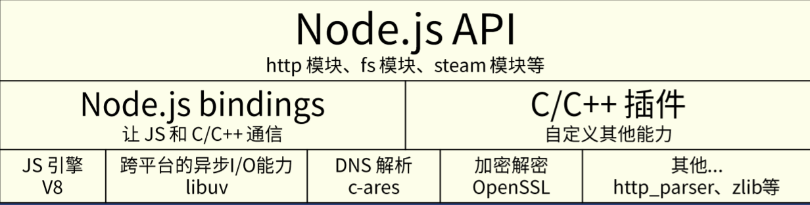

# Node.js 不是什么

## 不是web后端框架
不能把Node.js 与 Flask Spring 对比

## 不是编程语言
Node.js不是后端的JS

不能把Node.js 与 Python 或 PHP对比

# Node.js是什么
- 是一个平台
  - 它将多种技术组合起来
  - 让JS可以调用系统接口、开发后端应用

- Node.js用到了哪写技术
  - V8 引擎
  - libuv
  - C/C++ 实现的c-ares、http-parser、Open SSL、zlib等库

Node.js 源码 建议看0.10版本 （用的久 代码少）

推荐书[深入理解Node.js: 核心思想与源码分析](https://github.com/yjhjstz/deep-into-node)

# bindings 是什么
c/c++ 有一个库 http_parser 很高效，js想调用这个库，所有需要中间桥梁

- Node.js用C++ 对http_parser 进行封装，使它符合某些要求，封装的文件
叫http_parser_bindings.cpp
- 用Node.js提供的编译工具将其编译为.node 文件（不是必须编译成.node ）
- JS代码require 这个.node文件
- 这样JS就能掉用C++库，中间桥梁就是binding
- 由于Node.js提供了很多binding，所以是bindings
- 这就是bindings

# libuv 是什么
- FreeBSD系统上有kqueue
- Linux 有epoll
- Windows 有 IOCP
- Ryan 为了有一个跨平台的异步I/O库，开始写libuv
- libuv 会根据系统自动选择合适的方案

可用于TCP/UDP/DNS/文件等 异步操作

# V8是什么
- 将JS源代码变成本地代码并执行
- 维护调用栈，确保JS函数的执行顺序
- 内存管理，为所有对象分配内存
- 垃圾回收，重复利用无用的内容
- 实现JS的标准库

## 注意

- V8 不提供DOM API
- V8 执行JS是单线程的
- 可以开启2个线程分别执行JS
- V8本身是包含多个线程的，如垃圾回收为单独线程
- 自带event loop 但Node.js 基于libuv 自己做了一个EventLoop

# EventLoop

指一些阶段

## Node.js
有6个阶段  常用的是3个阶段

- timers
- I/O callbacks
- idle, prepare
- poll
- check
- close callbacks 

常用

- timers ↓   从timers开始
- poll   ↓   ~~~~~~ 只会停留在poll
- check  ↓   

###  Node.js EventLoop 阶段对应的API

setTimeout -> timers 

setImmediate -> check 

nextTick -> 当前阶段的后面  比如 在timers 阶段的nextTick 会在timers 之后， poll之前

promise.then -> 一般是nextTick 实现的， 可以当

**类似宏任务的API**

- setTimeout
- setImmediate
  
**类似微任务的API**

- nextTick 
- promise.then(fn)  // fn 是 当 resolve 的时候 把fn放到当前队列的后面
- await -> 转换成promise

## Chrome 

- 宏任务(一会) MacroTask
  - setTimeout (宏)

- 微任务(马上) MicroTask
  - promise.then(fn)   resolve -> 微任务
  - await 转换成promise 
  

# EventLoop 面试题

