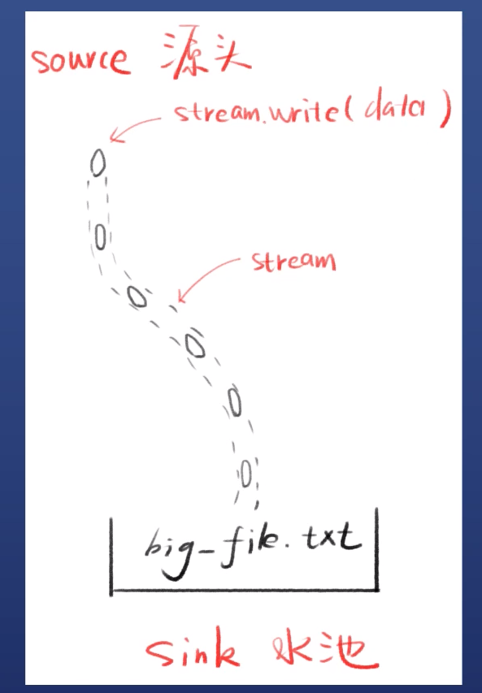
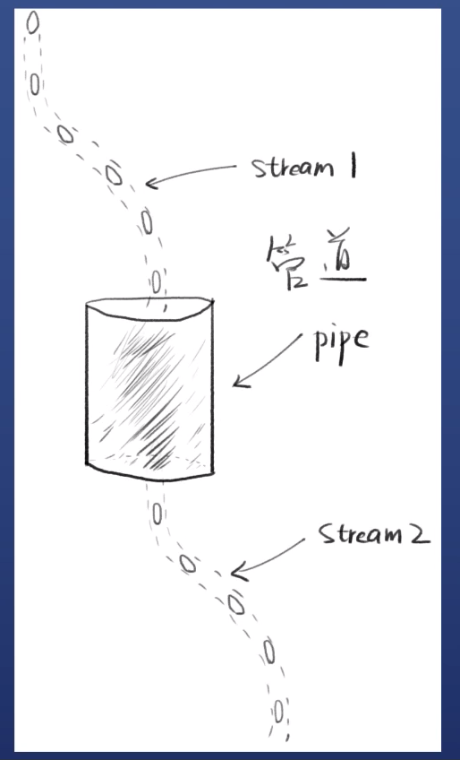
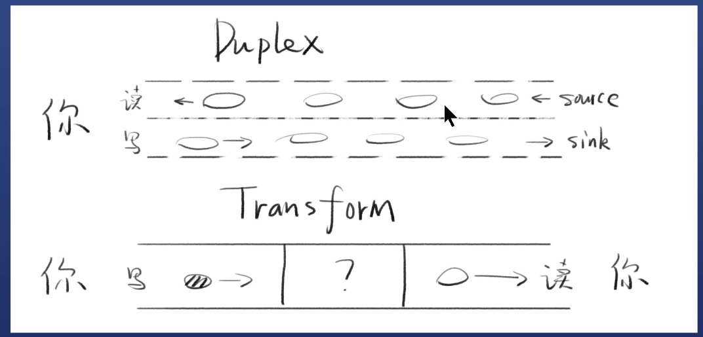

# 三个例子了解Stream

## 第一个例子

```js
const fs = require('fs');

const stream = fs.createWriteStream('./big_file.txt')

for (let i = 0; i < 1000000; i++) {

    stream.write(`这是地${i} 行内容， 我们需要很多内容，要不停地写文件~~~~~~~~~~~~~~~ \n`)
}

stream.end()
console.log('end')


```

- 打开流，多次往里面塞内容，关闭流
- 最终得到80M+的文件



- stream 是水流，但默认没有水
- stream.write 可以让水流中有水（数据）
- 每次写的小数据叫做chunk（块）
- 产生数据的一端叫做source（源头）
- 得到数据的一段叫做sink（水池）

## 第二个例子

```js

const http = require("http");

const server = http.createServer();
server.on('request', (request, response) => {
    fs.readFile('./big_file', (error, data) => {
        if (error) throw  error
        response.end(data)
        console.log('done')
    })
})

server.listen(8888)
console.log(8888)

```

- node.js 本身8m
- 运行这个例子 直接飙升到 95M (8 + 文件大小)
- 这就是不用stream的缺点

## 第三个例子

用stream 改写第二个例子

```js
const http = require("http");
const fs = require("fs");

const server = http.createServer();
server.on('request', (request, response) => {
    const stream = fs.createReadStream('./big_file.txt');
    stream.pipe(response);
})

server.listen(8888)
console.log(8888)

```

- nodejs内存占用基本不会超过30m
- 文件stream 和 response stream 通过管道相连

## 管道 pipe



- 两个流可以用一个管道相连
- steam1 的末尾 连接上stream2的开端
- 只要stream1有数据，就会流到stream2

上边第三个例子就是用管道 连接了文件流 和 http流 (response 实际上也是一个流)

常用代码

```js
stream1.pipe(stream2)
```

链式操作

```js
a.pipe(b).pipe(c)
// 等价于
a.pipe(b)
b.pipe(c)
```

## 管道可以通过事件实现

```js
// stream1 已有数据就塞给 steam2
stream1.on('data', (chunk) => {
    stream2.write(chunk)
})

// stream1 停了， 就停掉stream2
stream1.on('end', () => {
    stream2.end()
})
```

管道可以认为是个封装, 通过事件也能实现，不过一般这么写

`stream1.pipe(stream2)` 通过管道更清晰

# Stream 对象的原型 、 事件

`s = fs.createReadStream(path)`

s的对象层级是什么

- 自身属性（由fs.ReadStream 构造)
- 原型： stream.Readable.prototype
- 二级原型： stream.Stream.prototype
- 三级原型: events.EventEmitter.prototype
- 四级原型： Object.prototype

**Stream对象都继承了EventEmitter**

`node --inspect-brk 4.js` 调试node.js 打断点查看原型链

```js
const fs = require('fs');

const s = fs.createReadStream('./big_file.txt');

console.log(s)

```

## 支持的事件和方法

重点是 data, end ,drain,finish read write 事件

|     | Writable Stream                                                                                                              | Readable Stream                                                              |  
|-----|------------------------------------------------------------------------------------------------------------------------------|------------------------------------------------------------------------------|
| 事件  | data, end, error close, readable                                                                                             | drain, finish, error, close,pipe,unpipe                                      |
| 方法  | pipe() unpipe()<br/> wrap() <br/>destroy()<br/> read()<br/> unshift() <br/>resume() pause()<br/>isPaused()<br/>setEncoding() | write()<br/>destroy<br/>end()<br/>cork() uncork() <br/> setDefaultEncoding() |

```js
const http = require("http");
const fs = require("fs");

const server = http.createServer();
server.on('request', (request, response) => {
    const stream = fs.createReadStream('./big_file.txt');
    stream.on('data', (chunk) => {
        console.log('读取了一次数据');
        console.log(chunk.toString);
    })
    stream.on('end', () => {
        console.log('全部读完了');
    })
    stream.pipe(response);

})

server.listen(8888)
console.log(8888)

```

- drain事件表示（水）已流干，可以继续处理数据了 （面试常考）
- 用于处理高速or 耗时的数据流产生的堵塞问题 （会引发后续问题，后边再讨论）

```js
stream1.on('data', (chunk) => {
    // flag true 没有堵塞，可以继续写 false 表示堵塞先别写
    const flag = stream2.write(chunk)
    if (flag === false) {
        //    先别写
    }
    stream2.on('drain', () => {
        //    继续写
    })
})

// stream1 停了， 就停掉stream2
stream1.on('end', () => {
    stream2.end()
})
```

# Stream的4种分类

| 名称        | 特点       |
|-----------|----------|
| Readable  | 可读       |
| Writable  | 可写       |
| Duplex    | 可读可写（双向） |
| Transform | 可读可写（变化） |

Duplex 读和写相互不交叉， 不会读到自己写的内容

Transform 自己写 自己读， 但是中间会有转换器， 比如 编译时把 es6 代码写入， transform 成es5代码 然后自己读。



# Readable 和 Writable 的特点

## Readable Stream

禁止状态paused 和流动状态flowing

- 默认处于paused状态
- 添加data事件监听，它就变为flowing状态
- 删掉data事件监听，它就变为paused状态
- pause()可以将它变为 paused
- resume() 可以将它变为flowing

## Writable Stream

drain 流干事件

- 表示可以加点水了
- 调用stream.write(chunk)的时候，可能会得到false
- false的意思是写的太快了，数据挤压了
- 这个时候就不能再write, 要监听drain
- 等drain事件触发了，才能继续write

```js
const fs = require('fs')

function writeOneMillionTimes(writer, data) {
    let i = 1000000
    write()

    function write() {
        let ok = true
        do {
            i--
            if (i === 0) {
                // Last time!
                writer.write(data)
            } else {
                // See if we should continue, or wait.
                // Don't pass the callback, because we're not done yet.
                ok = writer.write(data)
                if (ok === false) {
                    console.log('不能再写了')
                }
            }
        } while (i > 0 && ok)
        if (i > 0) {
            // Had to stop early!
            // Write some more once it drains.
            writer.once('drain', () => {
                console.log('干涸了')
                write()
            })
        }
    }
}

const writer = fs.createWriteStream('./big_file.txt')
writeOneMillionTimes(writer, 'hello world')

```

finish事件

- 调用stream.end()之后，
- 且缓冲区数据都已经传给底层系统之后
- 触发finish事件

# 创建自己的流

## 创建一个Writeable Stream

```js
const {Writable} = require('stream')


const outStream = new Writable({
    write(chunk, encoding, callback) {
        console.log(chunk.toString())
        callback()
    }
})

// 用户输入流 通过管道连接到 写入流
process.stdin.pipe(outStream)

```

## 创建一个Readable Stream

```js
const {Readable} = require('stream')


const inStream = new Readable()

inStream.push('abcdefghijklmn')
inStream.push('opqrstuvwxyz')

inStream.push(null)

// inStream.pipe(process.stdout)

inStream.on('data', (chunk) => {

    process.stdout.write(chunk)
    console.log('写数据了')
})


```

上边的例子是整个数据都写好了才去读，

如何边写边读？ 默认不吐数据， 要数据的时候再吐

创建可读流 最好是先等别人调用read 方法后 再推数据 （推荐）

```js

const {Readable} = require('stream')


const inStream = new Readable({
    // read 会被  process.stdout 调用的
    read(size) {
        const char = String.fromCharCode(this.currentCharCode++);
        this.push(char)
        console.log(`push ${char}`)
        if (this.currentCharCode > 90) {// Z
            this.push(null)
        }
    }
})

inStream.currentCharCode = 65 // A
inStream.pipe(process.stdout)

```

## 创建双向流 Duplex

```js
const {Duplex} = require('stream')


const inoutStream = new Duplex({
    // 写内容 打印
    write(chunk, encoding, callback) {
        console.log(chunk.toString())
        callback()
    },

    // 读内容 给A~Z 字符
    read(size) {
        const char = String.fromCharCode(this.currentCharCode++);
        this.push(char)
        console.log(`push ${char}`)
        if (this.currentCharCode > 90) {// Z
            this.push(null)
        }
    }

})

inoutStream.currentCharCode = 65 // A

process.stdin.pipe(inoutStream).pipe(process.stdout)

```

## Transform 流

```js
const {Transform} = require('stream')


const upperCaseTr = new Transform({
    // 小写转大写
    transform(chunk, encoding, callback) {
        this.push(chunk.toString().toUpperCase())
    }
})

process.stdin.pipe(upperCaseTr).pipe(process.stdout)

```

# 内置的Transform Stream

## 压缩文件

node gzip.js ./big_file.txt

```js 
// this is gzip.js
const fs = require('fs');
const zlib = require('zlib')
const file = process.argv[2]


fs.createReadStream(file)
    .pipe(zlib.createGzip())
    .on('data', () => process.stdout.write('.'))
    .pipe(fs.createWriteStream(file + '.gz'))
    .on('finish', () => console.log('Done'))


```

不监听 'data' 事件去打印进度， 使用另一个Transform 流去改变，
好处是可以使用多个transform流

webpack 的loader 类似这个原理

vue-loader => sass-loader => css-loader => postcss-loader => style-loader

```js

const fs = require('fs');
const zlib = require('zlib')
const file = process.argv[2]
const {Transform} = require('stream')


const reportProgress = new Transform({
    transform(chunk, encoding, callback) {
        process.stdout.write('.');
        callback(null, chunk)
    }
})

fs.createReadStream(file)
    .pipe(zlib.createGzip())
    .pipe(reportProgress)
    // .pipe(xxxTransform)
    // .pipe(xxxTransform2)
    .pipe(fs.createWriteStream(file + '.gz'))
    .on('finish', () => console.log('Done'))

```

## 压缩并加密

这样压缩出来的文件内容， 都是密文

```js
const fs = require('fs');
const zlib = require('zlib')
const file = process.argv[2]
const {Transform} = require('stream')
const crypto = require('crypto')

const reportProgress = new Transform({
    transform(chunk, encoding, callback) {
        process.stdout.write('.');
        callback(null, chunk)
    }
})

fs.createReadStream(file)
    .pipe(crypto.createCipher('aes192', '123456'))
    .pipe(zlib.createGzip())
    .pipe(reportProgress)
    .pipe(fs.createWriteStream(file + '.gz'))
    .on('finish', () => console.log('Done'))

```

# Stream 在Nodejs里的用途

| Readable Stream               | Writable Stream                |
|-------------------------------|--------------------------------|
| HTTP Response -客户端            | HTTP Request - 客户端             |
| HTTP Request-服务端              | HTTP Response -服务端             |
| fs read stream                | fs write stream                |
| zlib stream                   | zlib stream                    |
| TCP sockets                   | TCP sockets                    |
| child process stdout & stderr | child process stdin            |
| process.stdin                 | process.stdout, process.stderr |
| 其他                            | 其他                             |

[数据流中的积压问题(背压 back pressure)](https://nodejs.org/zh-cn/docs/guides/backpressuring-in-streams/)


## 一些参考

[Node's Streams](https://jscomplete.com/learn/node-beyond-basics/node-streams)

Nodejs Stream 文档
[英文](https://nodejs.org/api/stream.html)
[中文](http://nodejs.cn/api/stream.html)

[stream 面试](https://juejin.cn/post/6844903635617316877)
