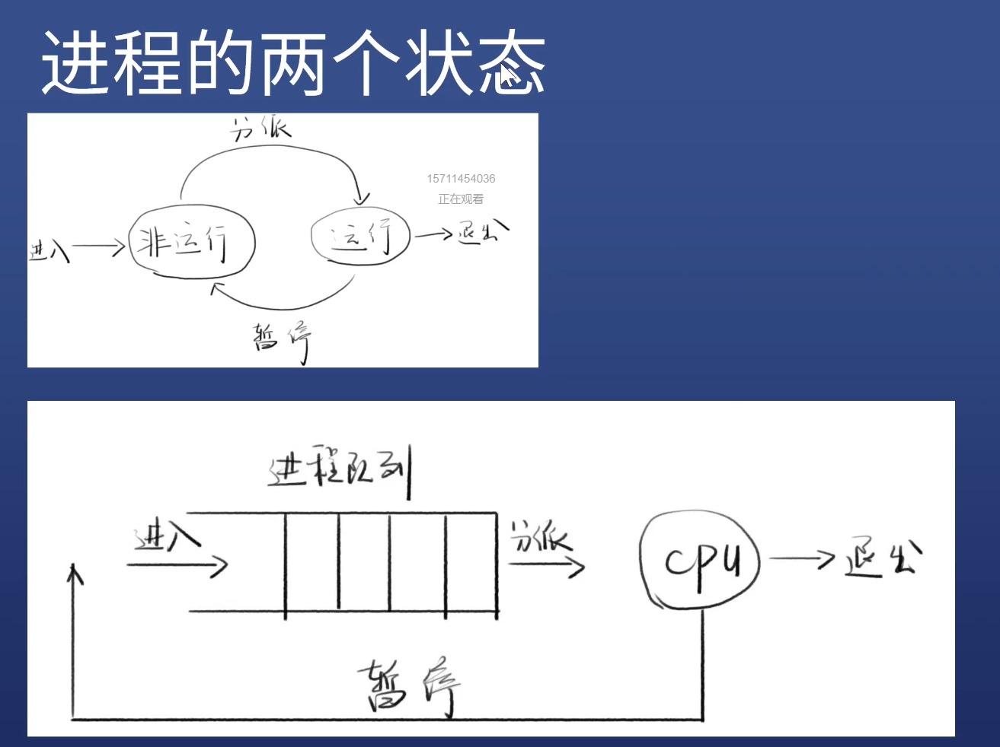
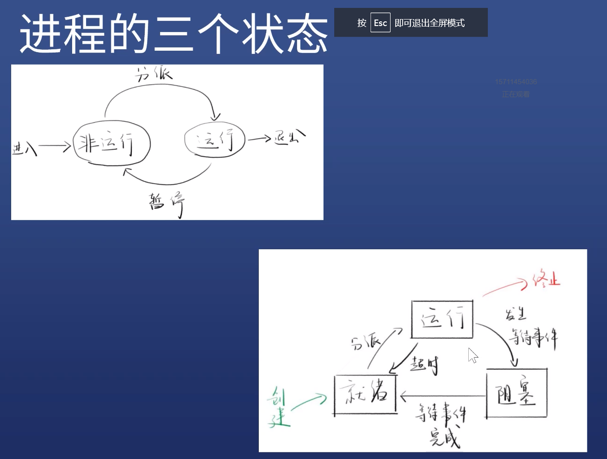

[代码](https://github.com/SealeyWang/child_process)
# 进程

什么是进程？ 简单来说
- 进程是程序的执行实例
- 程序在CPU上执行时的活动叫进程

特点
- 一个进程可以创建另一个进程（父进程与子进程）




## 什么是阻塞进程

阻塞

等待执行的进程中
- 都是非运行态
- 一些（A) 在等CPU资源
- 另一些（B)在等待I/O 完成（如文件读取）
- 如果这个时候把CPU分配给B进程，B还是在等I/O
- 我们把这个B叫做阻塞进程
- 因此，分派程序只会把CPU分配给非阻塞进程




# 线程

线程的引入
- 在面向进程的设计的系统中，进程是程序的基本执行实体
- 在面向线程设计的系统中，进程本身不是基本运行单元，而是线程的容器

引入的原因
- 进程是执行的基本实体，也是资源分配的基本实体
- 导致进程的创建、切换、销毁太消耗CPU时间
- 于是引入线程，线程作为执行的基本实体
- 而进程只作为资源分配的基本实体

概念
- cpu调度和执行的最小单元
- 一个进程中至少有一个线程，可以有多个线程
- 一个进程中的线程共享该进程的所有资源
- 进程的第一个线程叫做初始化线程
- 线程的调度可以由操作系统负责，也可以用户自己负责

# Nodejs 的进程控制

用 child_process 创建子进程

`exec(cmd, options, fn)`
```js
const child_process = require('child_process')

const {exec } = child_process


exec('ls ../', (error, stdout, stderr) => {
    console.log(error);
    console.log(stdout);
    console.log(stderr);
})

```

过程
- 子进程的运行结果存储在系统缓存中（最大200Kb）
- 等子进程运行结束以后，主进程再用回调函数读取子进程的运行结果


exec会返回stream流， 可用另一种方式 执行
```js

const stream = exec('ls ../')

stream.stdout.on('data', (chunk) => {
    console.log(chunk)
})

stream.stderr.on('data', (err) => {
    
})

```

promise化
```js
const util = require('util')
const child_process = require('child_process')

const {exec } = child_process
const exec2 = util.promisify(exec)
exec2('ls ../')
    .then(data => {
        console.log(data.stdout)
    })

```
有漏洞
- exec 第一个参数会被注入, 可能会执行恶意代码, 比如参数是 `ls ../ && pwd`
- 推荐使用 execFile （通过数组 把每个部分当做参数）

```js
const child_process = require('child_process')
const { execFile } = child_process
const userInput = '../'
execFile('ls', ['-la', userInput], (error, stdout) => {
    console.log(stdout)
})

```

常用的 options
- cwd
- env
- shell
- maxBuffer
```js
execFile('ls', ['-la', userInput], {
    cwd: 'C:\\', //可以修改执行目录， 命令默认在当前目录执行
    env: {NODE_ENV: 'development'},
    // shell: '' 可以指定shell类型 默认bash
    maxBuffer: 1024*1024, // 结果存储在内存的最大值
},(error, stdout) => {
    console.log(stdout)
})

```

## spawn

和execFile 使用基本一致， 不过只支持流，因为是流没有最大200kb限制，

经验
- 能用spawn 的时候就不要用execFile
```js

const { spawn } = child_process

const stream = spawn('ls', ['-la', '../'])

stream.stdout.on('data', (chunk) => {
    console.log(chunk.toString())
})
stream.stderr.on('data', (err) => {
    console.log(err.toString())

})
```

## fork

- 创建是一个子进程，执行Node脚本（只能执行node程序）
- `fork('./child.js')` 相当于执行 `spawn('node', ['./child.js'])`

特点
- 会多出一个message事件，用于父子通信
- 会多出一个send方法

```js
//n.js

const childProcess = require('child_process')
const n = childProcess.fork('./child.js')

n.on('message',  (m) => {
    console.log('n.js get message ', m);
})
// 给子进程发送消息
n.send({hello: 'word'})

```
```js
// child.js
setTimeout(() => {
    // 给父进程发信息
    process.send({foo: 'bar'})
},2000)

process.on('message', (m) => {
    console.log('child.js get message', m);
})

```
# Nodejs 的线程控制

历史
- child_process.exec v0.1.90 加入node.js

new Worker 这个API 比较新，不会经常用到， 它对CPU密集型操作很有用，
对I/O密集型的效率并不够高，Node.js 内置的异步 I/O 操作比工作线程更高效。
- v10.5.0 加入Node.js
- v11.7.0 之前需要 --experimental-worker 开启 


api
- isMainThread  检查当前线程是否是主线程
- new Worker(filename) 创建新线程
- parentPort 获取父端口
- postMessage (线程间通信)

事件
- message
- exit
