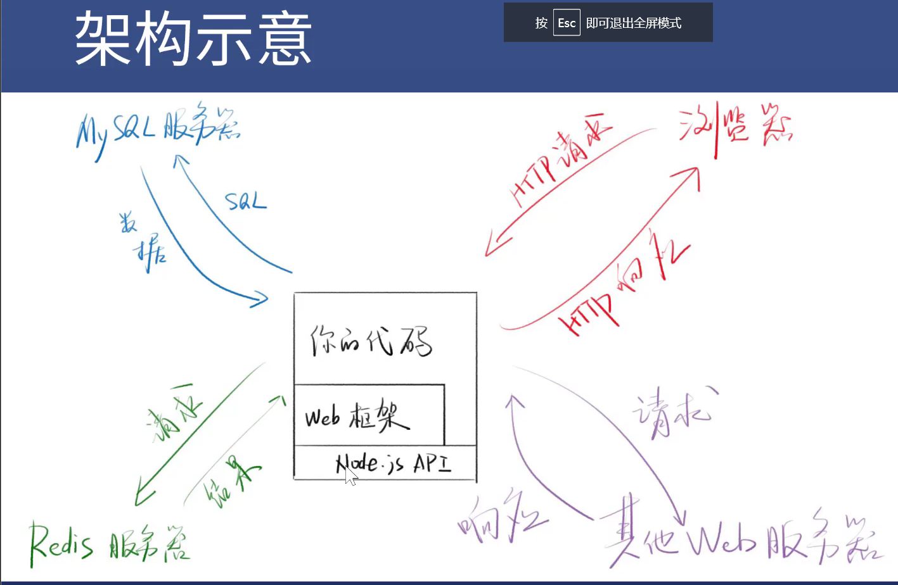
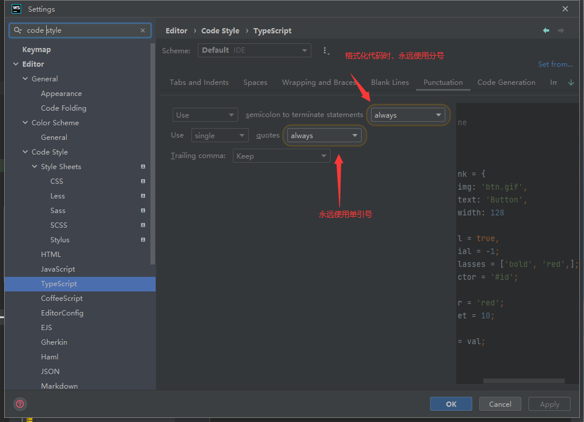
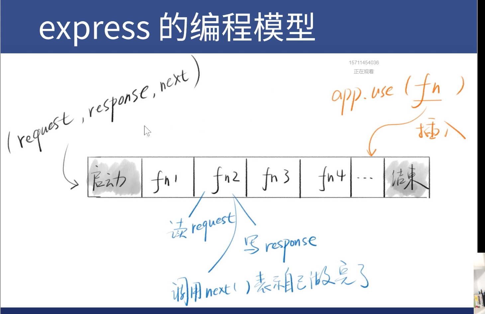
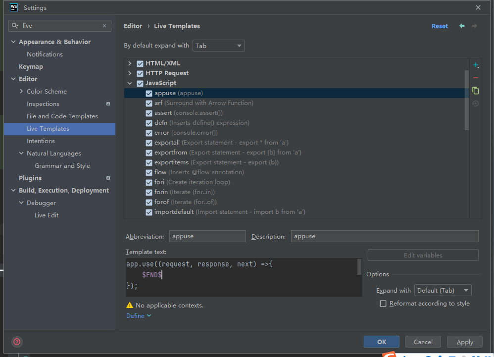

# http协议复习

curl -s -v 网址  
- -s 是silent， 用于隐藏进度条
- -v是verbose, 用于打印全部header
- *开头的是注释
- `>`开头的是http请求
- `<` 开头的是http相应


curl -L -s -o nul -v http://xiedaimala.com

- -L自动重定向
- -o null 是为了隐藏html文本
- Linux 、mac 要讲nul 改成 /dev/null

请求4个部分 
- 请求行
- 请求头
- 回车
- 请求体/消息体

响应4个部分
- 状态行
- 响应头
- 回车
- 响应体/消息体


Context Type常见类型 可参考下面链接
[常见 MIME 类型列表](https://developer.mozilla.org/zh-CN/docs/Web/HTTP/Basics_of_HTTP/MIME_types/Common_types)


# web框架功能

更方便的处理功能
- http请求与响应
- 连接数据库、Redis
- 路由
- 其他：html模板 

理念
- web框架的主流思路都是MVC
- Model处理数据相关逻辑
- View处理视图相关逻辑，前后端分离之后，View不重要
- Controller 负责其他逻辑





# Hello Express

[Express中文文档](https://expressjs.com/zh-cn/)

需要熟悉 Express 编程模型


初始化项目
- yarn init -y
- yarn add express

```js
const express = require('express')
const app = express()
const port = 3000

app.get('/', (req, res) => {
    res.send('Hello World! 你好')
})

app.listen(port, () => {
    console.log(`Example app listening on port ${port}`)
})


```

# hello TypeScript

- yarn global add typescript ts-node 
- yarn add @types/express 
- tsc --init 创建tsconfig.json
- 修改tsconfig target('es2015')  noImplicitAny(没有隐式的any)
- 将require 改为import

运行 ts-node app2.ts  (ts-node  ts-node-dev 不能用于生产环境)

```js
// app2.ts

```




# Express 的app对象
直接看定义的Types吧


# Express 脚手架

- npm i -g express-generator
- express -h
- express --view=ejs . (使用ejs 的后端模板引擎, 会覆盖package.json)


主要api 
- app.set  用于改配置
- app.use  用于使用中间件


# 使用typescript 开发Express 

- app.js 复制到 app2.ts
- yarn add @types/node --dev 这样才能使用require
- import 代替require 
- RequestHandler 和 ErrorRequestHandler 断言
- 将bin/www中入口改为app2.ts (`var app = require('../app');`)
- 添加script start:ts  node 改为ts-node


```ts
app.use(function(req, res, next) {
    next(createError(404));
} as RequestHandler);
// as RequestHandler  告诉 TS function类型 这个语法叫断言
```


# app.use 与 Express 变成模型]
创建项目, 按照需要引入
- npm init -y
- npm i express @types/express
- npm -g i typescript ts-node
- tsc --init 创建tsconfig.json
- 修改tsconfig target('es2015')  noImplicitAny(没有隐式的any)
- npm i -g express-generator
- express -h (查看 帮助)
- express --view=ejs . (使用ejs 的后端模板引擎, 会覆盖package.json)

## 理解app.use


```js
const express = require("express");

const app = express();

// 访问根目录
app.use((request, response, next) => {
    console.log(1);
    response.write("hi"); //如果使用  response.send() 则响应结束  下面的hi2 设置的响应不会执行
    next();// 如果不调用next() 则下面的 hi2 不会处理
});


// 处理两次访问目录
app.use((request, response, next) => {
    console.log(2);
    response.write("h2");
    response.end()
});

app.listen(3000)


```




# 中间件 与 路由

## 中间件
上图 fn 就是中间件，应为它是被插入到启动和结束中间的物件 

优点

模块化
- 使每个功能都通过一个函数实现
- 然后通过app.use将这个函数整合起来
- 如果把函数放到文件或npm里，就实现了模块化


自定义中间件


```js
// logger.js
const logger =  (request,response, next) => {
    console.log(request.url)
    next()
}
// 导出函数
exports.logger  =logger

```

```js
// app.js
const express = require("express");
const logger = require("./logger").logger;
const app = express();

app.use(logger);
```


## 路由

中间件 使路由变得很简单


插曲 webstorm 模板功能

Editor -> Live Templates  添加一个模板, 设置生效的环境, $END$ 是光标停住的位置


用app.use 自己实现路由
```js
app.use((request, response, next) =>{
    if( request.path=== '/' && request.method === 'GET') {
        response.end('这是根目录')
    }
    next()
});


app.use((request, response, next) =>{
    if( request.path=== '/aaa' && request.method === 'GET') {
        response.end('这是aaa')
    }
    next()
});

```

更方便的写法
- `app.use('/xxx', fn)`
- `app.get('/xxx', fn)`
- `app.post('/xxx', fn)`
- `app.route('/xxx').all(f1).get(f2).post(f3)`
- 这些都是语法糖


# 错误处理


```js

const express = require("express");
const logger = require("./logger").logger;
const app = express();


app.use((request, response, next) => {
    response.write("1");
    next();
});

app.use((request, response, next) => {
    response.write("2");
    if (true) {
        next('出错了');
    }
    next();
});

app.use((request, response, next) => {
    response.write("3");
    next();
});

// 错误处理函数
app.use((error, request, response, next) =>{
    response.write(error)
    response.end()
    next()
});

app.listen(3000);
console.log("listen 3000");


```

next() 函数是 NextFunction 类型

```ts
export interface NextFunction {
    (err?: any): void;
    /**
     * "Break-out" of a router by calling {next('router')};
     * @see {https://expressjs.com/en/guide/using-middleware.html#middleware.router}
     */
    (deferToNext: 'router'): void;
    /**
     * "Break-out" of a route by calling {next('route')};
     * @see {https://expressjs.com/en/guide/using-middleware.html#middleware.application}
     */
    (deferToNext: 'route'): void;
}
```

next() 可以传参数 

next(error)
- 会直接进入errorHandler ， 不执行后面的中间件
- errorHandler的默认实现见[文档](https://expressjs.com/en/guide/error-handling.html#the-default-error-handler)

如何自定义errorHandler
- 文档说一般在UI后定义
- `app.use((err, req,res,next)=>)`
- 可定义多个这样的中间件


```js
const express = require("express");
const logger = require("./logger").logger;
const app = express();


app.use((request, response, next) => {
    console.log(1);
    next();
});

app.use((request, response, next) => {
    console.log(2);

    if (true) {
        next("出错了");
    } else {
        next();
    }
});

app.use((request, response, next) => {
    console.log(3);

    next();
});

// 错误处理函数
app.use((error, request, response, next) => {
    if (response.headersSent) {
        return next(error);
    }
    response.status(500);
    response.send(error);
});

app.listen(3000, () => {
    console.log("listen 3000");
});


```


多个错误处理

```js
const express = require("express");
const logger = require("./logger").logger;
const app = express();


app.use((request, response, next) => {
    console.log(1);
    next();
});

app.use((request, response, next) => {
    console.log(2);

    if (true) {
        next("出错了");
    } else {
        next();
    }
});

app.use((request, response, next) => {
    console.log(3);

    next();
});

// 错误处理函数
app.use((error, request, response, next) => {
   error +='错误处理1'
    next(error)

});


// 错误处理函数
app.use((error, request, response, next) => {
    error +='错误处理2'

    if (response.headersSent) {
        return next(error);
    }
    response.status(500);
    response.send(error);
});


app.listen(3000, () => {
    console.log("listen 3000");
});


```


## next('route')


next('route')  //传了两个函数  可以跳过后面的函数
[源代码](https://github.com/expressjs/express/blob/4.x/lib/router/route.js#L114)

```js
app.get('/a_route_behind_paywall',
  (req, res, next) => {
    if (!req.user.hasPaid) {
      // continue handling this request
      next('route')  //传了两个函数  可以跳过后面的函数
    } else {
      next()
    }
  }, (req, res, next) => {
    PaidContent.find((err, doc) => {
      if (err) return next(err)
      res.json(doc)
    })
  })

```

[代码demo1](https://github.com/SealeyWang/express-demo1)

[代码demo2](https://github.com/SealeyWang/express-demo2)
