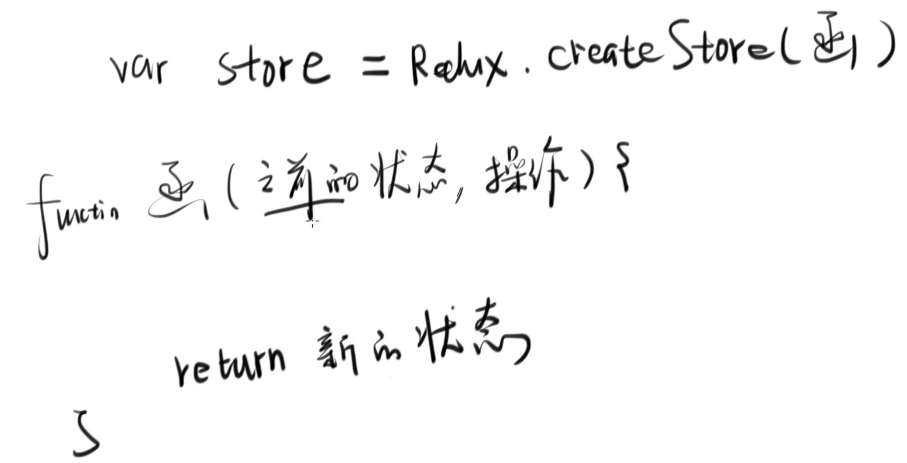

[代码 react-redux-demo1](https://github.com/CaoBaoWang/react-redux-demo1)

- Redux 一定要跟React 一起用吗？
- Redux 怎么跟React一起用，有哪些重要概念
- Redux 和 React 一起用有什么不方便？ 为什么需要react-redux?

# 重要API
## Redux重要API

### Reducer函数

```js
const reducer = (state, action) => {
    if(state === undefined) {
        return {n: 0}
    }else {
        if(action.type === 'add'){
            var newState = {n: state.n + action.payload}
        }
    }

}
```

### store 
```js
const store = createStore(reducer) 


store.subscribe(()=> {
    render()
})

store.dispatch({type: 'add', payload: 1})


```

## React-Redux重要API

### Provider 标签
```js
<Provider  store={store}>
 <App />
</Provider>

```

### connect 函数

```js
function mapStateToProps(state) {
    return {
        n: state.n
    }
}

function mapDispatchToProps(dispatch) {
    return {
        add1: ()=> dispatch({type: 'add', payload: 1})
    }
}

export default connect(mapStateToProps, mapDispatchToProps)(App);

```


